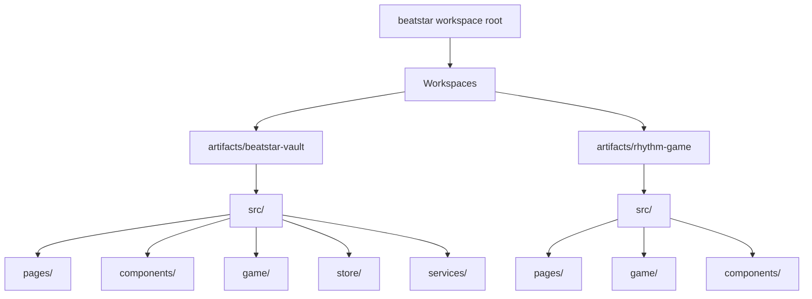
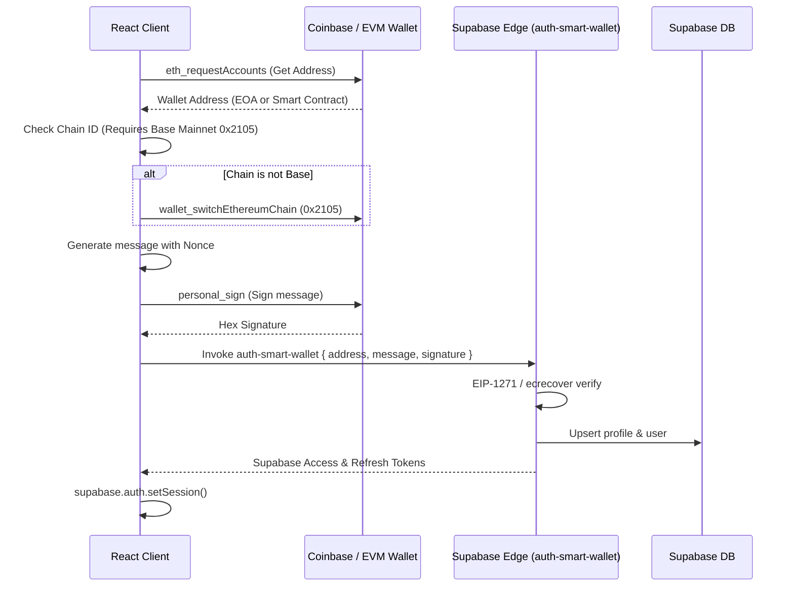
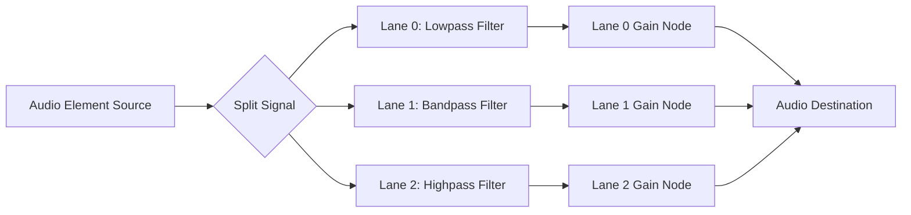

# Project Dossier: th3vault & Beatstar (PIM) Integration

This dossier serves as the comprehensive, authoritative source of truth for **th3vault & Beatstar (PIM) Integration**, a hybrid ecosystem bridging a high-fidelity HTML5 canvas rhythm game and a digital collectible card engine under a unified, premium brutalist cyberpunk aesthetic.

---

## 1. Project Vision & Core Thesis

The project operates under a three-tiered loop designed to maximize user engagement and capture value:

> [!IMPORTANT]
> **The Retention Thesis:**
> **Music Unlocks Gameplay** $\to$ **Gameplay Unlocks Ownership** $\to$ **Ownership Unlocks Status**

> [!CAUTION]
> **DEVELOPMENT WORKFLOW RULE (BEATSTAR VAULT FIRST):**
> 1. **Primary Target (`beatstar-vault`)**: All new features, bug fixes, UI improvements, rhythm engine upgrades, and dossier updates MUST be implemented first in **`artifacts/beatstar-vault`** (`@workspace/beatstar-vault`).
> 2. **Secondary Target (`rhythm-game`)**: **`artifacts/rhythm-game`** is a secondary standalone package. Pop back to sync `rhythm-game` with `beatstar-vault` only after changes are validated in `beatstar-vault`.

1. **Music Unlocks Gameplay**: Fans navigate to the application via deep links (e.g., from TikTok or Spotify) to access a free playable level for the daily song release (365 songs total—one for every day of the year).
2. **Gameplay Unlocks Ownership**: Reaching specific score and accuracy thresholds on a level awards collectible card packs (Gacha drops) containing card stems, registry proofs, and card burn assets.
3. **Ownership Unlocks Status**: Players display their earned collections, showcase streaks, view first-discoverer certifications, and connect external Web3 wallets to permanently establish ownership and status.

### The Three Simultaneous Economies
To sustain long-term engagement, the application orchestrates three interlocking value systems:
* **The Skill Economy**: Driven by gameplay accuracy, timing windows, swipe precision, hold tracking, and high scores.
* **The Scarcity Economy**: Powered by global hard supply caps, rarity tiers (Common, Uncommon, Rare, Legendary, Mythic), mintable vs gameplay copy splits, and card burning sinks.
* **The Social Economy**: Expressed through collection prestige scores, provenance tracking, replay ghosts, and first-discoverer status.

### Product Classification: Systems Product
Moving beyond a simple rhythm prototype or static NFT gallery, the project is classified as an **Experimental Live-Service Platform**. It features server-authoritative transactions, progression currencies ($V\text{⚡}$ tokens), audio-reactive gameplay mutations (Vocal Isolation, Bass Realm, Corrupted Signal), and stateful longitudinal player telemetry.

---

## 2. Technical Architecture & Workspace Layout

The codebase is organized as a React 19 + TypeScript monorepo managed with **pnpm workspaces**.



### Core Technologies
- **Client Framework**: React 19, TypeScript
- **Routing**: `wouter` (lightweight declarative routing for React)
- **State Management**: `zustand` (fast, reactive global stores for vault, audio, and auth state)
- **Styling**: Vanilla CSS + TailwindCSS 4, modern Outfit & Roboto Mono Google Fonts, customized HSL dark-mode palettes
- **Database & Auth**: Supabase (Auth, Row Level Security, PostgreSQL storage, Edge Functions)
- **Animations**: Framer Motion (used for cinematic card reveals, pack opening overlays, stickers, and page transitions)
- **Audio & Rendering**: Web Audio API (3-way crossover split filters) + HTML5 2D Canvas 60fps rendering loop

### Client Package Configurations
The monorepo contains two primary packages:
1. **`@workspace/beatstar-vault` ([beatstar-vault](file:///Users/studio/BEATSTAR.th3scr1b3.art/beatstar/artifacts/beatstar-vault))**: The primary portal containing the collectible card vault dashboard, Web3 wallet auth, card forge rarity upgrade, duplicate fusion engine, gacha pack shop, pitch deck presentation, beatmap editor, listen jukebox, voyeur telemetry, and embedded rhythm gameplay engine.
2. **`@workspace/rhythm-game` ([rhythm-game](file:///Users/studio/BEATSTAR.th3scr1b3.art/beatstar/artifacts/rhythm-game))**: A dedicated standalone client package representing the rhythm game component (with campaign chapter maps, stage winding roads, interactive tutorial, options, calibration offsets, and independent play mode).

### Key Files & Pathways
* **App Shell & Router**: [App.tsx (Vault)](file:///Users/studio/BEATSTAR.th3scr1b3.art/beatstar/artifacts/beatstar-vault/src/App.tsx) | [App.tsx (Rhythm)](file:///Users/studio/BEATSTAR.th3scr1b3.art/beatstar/artifacts/rhythm-game/src/App.tsx)
* **Game Engine Pages**:
  * [GamePlay.tsx (Vault)](file:///Users/studio/BEATSTAR.th3scr1b3.art/beatstar/artifacts/beatstar-vault/src/pages/GamePlay.tsx) | [Game.tsx (Rhythm)](file:///Users/studio/BEATSTAR.th3scr1b3.art/beatstar/artifacts/rhythm-game/src/pages/Game.tsx) (Canvas-based rendering, 3-band audio splitting, note input handler)
  * [GameResults.tsx (Vault)](file:///Users/studio/BEATSTAR.th3scr1b3.art/beatstar/artifacts/beatstar-vault/src/pages/GameResults.tsx) | [Results.tsx (Rhythm)](file:///Users/studio/BEATSTAR.th3scr1b3.art/beatstar/artifacts/rhythm-game/src/pages/Results.tsx) (Accuracy calculations and gacha rewards mapping)
  * [Tutorial.tsx](file:///Users/studio/BEATSTAR.th3scr1b3.art/beatstar/artifacts/rhythm-game/src/pages/Tutorial.tsx) (Interactive step-by-step game tutorial)
  * [Options.tsx](file:///Users/studio/BEATSTAR.th3scr1b3.art/beatstar/artifacts/rhythm-game/src/pages/Options.tsx) (Keybind configuration, audio offset calibration, miss limit toggle)
* **Collectibles Core**:
  * [LandingPage.tsx](file:///Users/studio/BEATSTAR.th3scr1b3.art/beatstar/artifacts/beatstar-vault/src/pages/LandingPage.tsx) (Scaled-up dashboard hero & daily card portal)
  * [HomePage.tsx](file:///Users/studio/BEATSTAR.th3scr1b3.art/beatstar/artifacts/beatstar-vault/src/pages/HomePage.tsx) (Main vault landing interface)
  * [PackRevealPage.tsx](file:///Users/studio/BEATSTAR.th3scr1b3.art/beatstar/artifacts/beatstar-vault/src/pages/PackRevealPage.tsx) (Cinematic cards opening animation)
  * [CodexPage.tsx](file:///Users/studio/BEATSTAR.th3scr1b3.art/beatstar/artifacts/beatstar-vault/src/pages/CodexPage.tsx) (Glossary of all 365 daily release cards)
  * [ForgePage.tsx](file:///Users/studio/BEATSTAR.th3scr1b3.art/beatstar/artifacts/beatstar-vault/src/pages/ForgePage.tsx) (Burn cards for tokens, upgrade rarities, and fuse duplicates)
  * [CardDesignShowcase.tsx](file:///Users/studio/BEATSTAR.th3scr1b3.art/beatstar/artifacts/beatstar-vault/src/pages/CardDesignShowcase.tsx) (Visual showcase of all card design tiers and holographic foils)
* **Campaign & Chapters**:
  * [Campaign.tsx (Vault)](file:///Users/studio/BEATSTAR.th3scr1b3.art/beatstar/artifacts/beatstar-vault/src/pages/Campaign.tsx) | [Campaign.tsx (Rhythm)](file:///Users/studio/BEATSTAR.th3scr1b3.art/beatstar/artifacts/rhythm-game/src/pages/Campaign.tsx) (Constellation Sector Map UI)
  * [Chapter.tsx (Vault)](file:///Users/studio/BEATSTAR.th3scr1b3.art/beatstar/artifacts/beatstar-vault/src/pages/Chapter.tsx) | [Chapter.tsx (Rhythm)](file:///Users/studio/BEATSTAR.th3scr1b3.art/beatstar/artifacts/rhythm-game/src/pages/Chapter.tsx) (Winding Pathway Level UI + Milestone Rewards bar)
* **Creation & Platform Tools**:
  * [BeatmapEditor.tsx](file:///Users/studio/BEATSTAR.th3scr1b3.art/beatstar/artifacts/beatstar-vault/src/pages/BeatmapEditor.tsx) (Interactive visual beatmap creation and editing suite)
  * [AdminPage.tsx](file:///Users/studio/BEATSTAR.th3scr1b3.art/beatstar/artifacts/beatstar-vault/src/pages/AdminPage.tsx) (Live service economy balance & gacha drop tuning dashboard)
  * [PitchDeck.tsx](file:///Users/studio/BEATSTAR.th3scr1b3.art/beatstar/artifacts/beatstar-vault/src/pages/PitchDeck.tsx) (Interactive ecosystem presentation deck)
  * [ListenPage.tsx](file:///Users/studio/BEATSTAR.th3scr1b3.art/beatstar/artifacts/beatstar-vault/src/pages/ListenPage.tsx) (Full track & audio stems player)
  * [VoyeurPage.tsx](file:///Users/studio/BEATSTAR.th3scr1b3.art/beatstar/artifacts/beatstar-vault/src/pages/VoyeurPage.tsx) (Real-time global telemetry feed)
* **API, State & Data Layer**:
  * [api.ts (Vault)](file:///Users/studio/BEATSTAR.th3scr1b3.art/beatstar/artifacts/beatstar-vault/src/game/api.ts) | [api.ts (Rhythm)](file:///Users/studio/BEATSTAR.th3scr1b3.art/beatstar/artifacts/rhythm-game/src/game/api.ts) (Release catalog fetching, local file mappings, and time-lock safety checks)
  * [vaultService.ts](file:///Users/studio/BEATSTAR.th3scr1b3.art/beatstar/artifacts/beatstar-vault/src/services/vaultService.ts) (Card claims, burn/sell logic, upgrade logic, database mappings, and safety fallbacks)
  * [useVaultStore.ts](file:///Users/studio/BEATSTAR.th3scr1b3.art/beatstar/artifacts/beatstar-vault/src/store/useVaultStore.ts) (Global collection, tokens balance, and reveal state)
  * [useAuthStore.ts](file:///Users/studio/BEATSTAR.th3scr1b3.art/beatstar/artifacts/beatstar-vault/src/store/useAuthStore.ts) (Web3 wallet connect and email/anonymous fallback state)
  * [progress.ts (Vault)](file:///Users/studio/BEATSTAR.th3scr1b3.art/beatstar/artifacts/beatstar-vault/src/game/progress.ts) | [progress.ts (Rhythm)](file:///Users/studio/BEATSTAR.th3scr1b3.art/beatstar/artifacts/rhythm-game/src/game/progress.ts) (Medal and high score persistence layer)

---

## 3. Database Schema & Data Flows

The backend is powered by a shared Supabase database with PostgreSQL tables protected by Row Level Security (RLS) rules.

### A. Profiles (`public.profiles`)
Stores account telemetry, wallet bindings, token balance, and streak counts.
```sql
CREATE TABLE public.profiles (
    id UUID PRIMARY KEY REFERENCES auth.users(id) ON DELETE CASCADE,
    username TEXT UNIQUE,
    wallet_address TEXT,
    tokens INT DEFAULT 0,
    daily_standard_claims INT DEFAULT 0,
    daily_premium_claims INT DEFAULT 0,
    last_claim_day INT DEFAULT 0,
    last_free_pack_day INT DEFAULT 0,
    has_onboarded BOOLEAN DEFAULT FALSE,
    streak_count INT DEFAULT 0,
    total_pulls INT DEFAULT 0,
    pulls_since_rare_plus INT DEFAULT 0,
    created_at TIMESTAMPTZ DEFAULT NOW()
);
```

### B. Vault Collections (`public.vault_collections`)
Records owned cards, acquired dates, and gacha origin.
```sql
CREATE TABLE public.vault_collections (
    id UUID PRIMARY KEY DEFAULT gen_random_uuid(),
    owner_id UUID NOT NULL REFERENCES auth.users(id) ON DELETE CASCADE,
    card_id TEXT NOT NULL,
    rarity TEXT NOT NULL CHECK (rarity IN ('common', 'uncommon', 'rare', 'legendary', 'mythic')),
    source TEXT NOT NULL CHECK (source IN ('daily_claim', 'pack_free', 'pack_taste', 'pack_light', 'pack_dark', 'pack_month', 'pack_miss_out', 'pack_special_picks', 'pack_prophecy', 'pack_alpha', 'vault_token', 'targeted_pull', 'fusion')),
    claimed_at TIMESTAMPTZ DEFAULT NOW(),
    edition INT DEFAULT 1,
    max_supply INT DEFAULT 50,
    is_echo BOOLEAN DEFAULT FALSE,
    echo_generation INT DEFAULT 0,
    echo_source_day INT,
    proof TEXT DEFAULT 'none',
    ultra_reward JSONB,
    blockchain_status TEXT DEFAULT 'off-chain',
    CONSTRAINT unique_owner_card_rarity UNIQUE (owner_id, card_id, rarity)
);
```

### C. Gameplay Records (`public.gameplay_records`)
Logs game history and marks earned rewards to prevent double-claiming.
```sql
CREATE TABLE public.gameplay_records (
    id UUID PRIMARY KEY DEFAULT gen_random_uuid(),
    user_id UUID NOT NULL REFERENCES auth.users(id) ON DELETE CASCADE,
    song_id TEXT NOT NULL,
    score INT NOT NULL,
    accuracy NUMERIC(5,2) NOT NULL,
    max_combo INT NOT NULL,
    medal TEXT NOT NULL CHECK (medal IN ('NONE', 'BRONZE', 'SILVER', 'GOLD', 'PLATINUM')),
    pack_rewarded BOOLEAN DEFAULT FALSE,
    reward_tier TEXT NOT NULL CHECK (reward_tier IN ('common', 'enhanced', 'rare', 'epic', 'legendary', 'mythic')),
    timestamp TIMESTAMPTZ DEFAULT NOW()
);
```

### D. Global Supply (`public.global_supply`)
Tracks print numbers of cards globally to enforce hard caps on card availability.
```sql
CREATE TABLE public.global_supply (
    card_id_rarity TEXT PRIMARY KEY, -- Formatted as "{cardId}-{rarity}"
    supply INT DEFAULT 0
);
```

### E. Supabase Edge Functions
Security is enforced by processing all economy and claim transactions server-side inside Deno-based Supabase Edge Functions:
1. **`vault-engine`**:
   - `claimDailyDrop`: Checks daily limits, increments profile claim count, rolls rarity, mints a `vault_collections` entry, and registers edition supply.
   - `purchasePack`: Implements gacha algorithm, evaluates active conditional modifiers, rolls rates, charges tokens, and inserts rolled cards.
   - `burnCard`: Burns/sells a card for tokens. Handles generational Echo variant creation and split payouts securely.
   - `targetedPull`: Deducts 500 V⚡ tokens and awards a specific card.
   - `rarityUpgrade`: Deducts 150 V⚡ tokens and upgrades a card's rarity by 1 tier.
   - `duplicateFusion`: Combines 3 identical cards (same day and rarity) into 1 card of the next tier.
2. **`auth-smart-wallet`**:
   - Verifies Ethereum/EVM signatures (MetaMask personal signs & Coinbase Smart Wallet EIP-1271 signatures) on Base Mainnet to authorize account creation and session establishment.

---

## 4. EVM & Smart Wallet Web3 Authentication

Auth routes users through standard EVM wallets or the Coinbase Smart Wallet using signature-based authorization constraints, designed with a **progressive decentralization** strategy.



### Core Configuration
- **Network**: **Base Mainnet (Chain ID `8453` / Hex `0x2105`)**
- **RPC URL**: `https://mainnet.base.org`
- **Block Explorer**: `https://base.blockscout.com`

---

## 5. Rhythm Gameplay & Canvas Render Engine

Gameplay rendering operates via an HTML5 Canvas drawing loop triggered by `requestAnimationFrame`, projecting descending note coordinates onto a perspective 3D highway.

### 1. Approach Time Scaling
The speed at which notes travel from the horizon to the hit line scales dynamically with difficulty level:
$$\text{Approach Time (seconds)} = \max(1.35, 2.5 - (\text{Difficulty Level} - 1) \times 0.128)$$

### 2. Perspective Geometry Mapping
The perspective highway maps notes from 3D space onto the 2D canvas. The progression $P$ of a note (where $P = 0$ is the horizon, and $P = 1.0$ is the hit line) maps screen Y coordinate:
$$Y_{\text{note}} = Y_{\text{top}} + (Y_{\text{bottom}} - Y_{\text{top}}) \times P$$
Lanes are segmented into 3 tracks:
- **Lane 0 (Bass)**: Rendered on the Left. Under the **Bass Realm** modifier, Lane 0 notes are rendered **60% thicker**, **28% wider**, and styled with a glowing neon purple accent (`#a855f7`).
- **Lane 1 (Mids)**: Rendered in the Center.
- **Lane 2 (Treble)**: Rendered on the Right.

### 3. Note Types & PIM Signature Mechanics

The gameplay engine classifies note mechanics across four distinct operational tiers:

#### A. Core Gameplay Notes (100% of Track Coverage)
- **Tap**: Standard hit target.
- **Hold**: Sustained ribbon track requiring key depression until terminus.
- **Swipe**: Directional flick (`↑`, `↓`, `←`, `→`, diagonals) unlocked at Level 4+.
- **Hold + Swipe End**: Sustained rail culminating in a directional swipe release.
- **Double Tap**: Simultaneous dual-lane targets.

#### B. Advanced Notes
- **Slide (Drag)**: Continuous finger/path tracking across lanes.
  $$\text{visualLane} = \text{lerp}(\text{visualLane}, \text{currentLane}, 0.18)$$
- **Zigzag Slide**: Snaking left/right trajectory suited for electronic fills and solos.
- **Repeater**: High-frequency tap train over a sustained rhythm.
- **Chain**: Automated note sequence activated by hitting the lead note cleanly.
- **Mine / Ghost**: Hazardous obstacle—hitting causes score penalty (-500), resets combo, and leaks data. Avoiding it passes safely.
- **Lift**: Timing window calibrated to key *release* on beat.
- **Harmony**: Dual-lane simultaneous presses during choruses.
- **Scratch**: Rapid circular gesture for vinyl/DJ breaks.

#### C. Performance & Special Event Notes
- **Perfect Window Accent Note**: Enhanced target head granting +800 point bonus.
- **Break Note**: Beat drop target triggering camera shudder, particle burst, and +1200 point reward.
- **Choice Note**: Branching dual paths (Left/Right) offering dynamic player route choices.
- **Burst Note**: Pulsing expanding ring requiring precise hit before full expansion.

#### D. PIM Signature Feature: Remix Note ⚡
> [!IMPORTANT]
> **Audio-Reactive Remix Note Mechanics:**
> Hitting a **Remix Note** (styled with a glowing ethereal stem rune) with PERFECT timing triggers real-time stem arrangement mutations:
> 1. **Web Audio Stem Mutation**: Automatically alters stem balance (`vocals_isolate`, `drums_mute`, `bass_boost`, or `lead_solo`) for 4–8 beats via `audioManager.triggerRemixStemEffect()`.
> 2. **Visual Palette Inversion**: Temporarily flips the canvas theme and renders a neon HUD banner `⚡ STEM REMIX ACTIVE ⚡`.
> 3. **Score Amplification**: Awards an instant +1000 point bonus and 1.5x active combo score boost.

### 4. Timing Windows & Judgment
Timing window tolerances scale down as difficulty increases:

| Judgment | Timing Window Formula (Seconds) | Base Score |
| :--- | :--- | :--- |
| **Perfect+** | $\le \max(0.030, 0.060 - (\text{diff} - 1) \times 0.0033)$ | 500 points |
| **Perfect** | $\le \max(0.055, 0.110 - (\text{diff} - 1) \times 0.0061)$ | 300 points |
| **Good** | $\le \max(0.100, 0.190 - (\text{diff} - 1) \times 0.010)$ | 150 points |
| **Miss** | $> \max(0.190, 0.360 - (\text{diff} - 1) \times 0.019)$ | 0 points (Resets Combo) |

### 5. Difficulty Combo Multipliers
Active score multiplier caps are determined by track difficulties:
- **LIGHT (Level 1-3)**: Cap of 3x.
- **DARK (Level 4-6)**: Cap of 4x.
- **VOID (Level 7-10)**: Cap of 5x.

### 6. Power-Up Overlays (Flow-State Amplification)
Maintaining high combos unlocks dynamic flow-state overlays:
- **FEVER (Combo $\ge 20$)**: 9-second duration. Score multiplier is 2x. Upgrades all standard `PERFECT` hits to `PERFECT+` automatically. Styled in gold (`#E5B800`).
- **SURGE (Combo $\ge 40$)**: 11-second duration. Score multiplier is 3x. **Autoplay Mode**: Automatically grabs hold notes and tracks slide paths. Styled in hot pink (`#FF1493`).
- **SIGNAL LOCK (Combo $\ge 60$)**: 14-second duration. Score multiplier is 4x. Styled in neon green (`#39FF14`).

### 7. Death & Continue System
- **Miss Limit**: Accumulating 3 misses triggers a failure state.
- **Rewind Logic**: The engine pauses and rewinds the audio track by 2.5 seconds.
- **Continues**: Up to **3 continues** per song. Retrying a continue decreases remaining continue count, resets miss count, and triggers a backward scroll animation over 1.2s.

---

## 6. Split-band Audio & Lane Muting Subsystem (Sonic Punishment)

The game feeds physical performance accuracy back to the user through real-time audio channel filtering, creating **performance-driven adaptive music degradation**.



### Frequency Band Routing
- **Lane 0 (Bass)**: `lowpass` filter (Frequency: `300 Hz` | Q-factor: `0.8`).
- **Lane 1 (Mids)**: `bandpass` filter (Frequency: `1200 Hz` | Q-factor: `0.7`).
- **Lane 2 (Treble)**: `highpass` filter (Frequency: `3200 Hz` | Q-factor: `0.8`).

### Muting & Recovery Rules
- **Muting on Miss**: Ramps gain node down to `0.04` over `0.12 seconds`.
- **Active Restore on Hit**: Striking a note in a muted lane instantly un-silences that band, ramping gain back over `0.25 seconds`.
- **Passive Auto-Recovery**: If a lane is muted and no note appears, gain automatically recovers after a `3.5-second` (3500ms) safety window, ramping up over `0.4 seconds`.

---

## 7. Codex, Audio Previews & Active Modifiers

### 1. Codex Sorting & Filtering
Supports multi-tier organization across all 365 songs:
- **Sort Modes**: `day-asc`, `day-desc`, `rarity`.
- **Filter Modes**: `all`, `owned`, `missing`, `beyond`.

### 2. Audio Preview Duration Constraints
- **Common Cards**: 15 seconds audio preview.
- **Uncommon Cards**: 60 seconds preview.
- **Rare, Legendary, & Mythic Cards**: Unlimited/Full song preview.
- **Mythic Stems**: Owning Mythic cards unlocks raw session stem downloads.

### 3. Active Gameplay Modifiers
- **Vocal Isolation**: Boosts vocal channel (Lane 1 gain = 2.2; Lanes 0 & 2 = 0.15).
- **Bass Realm**: Amplifies low-end (Lane 0 gain = 2.6). Lane 0 notes rendered neon purple (`#a855f7`), 60% thicker, 28% wider.
- **Corrupted Signal**: Pitch/tempo drift ($\pm 4\%$), CRT scanlines, and screen translate shake.

---

## 8. Economy Rebalance v2.1, Gacha & Admin Controls

### 1. Velocity-Balanced Supply Structure
| Rarity Tier | Old Static Cap | New Gameplay Copy Cap | New Mintable Cap | Token Burn Value |
| :--- | :--- | :--- | :--- | :--- |
| **Common** | 50 | 2,000 | 0 (Off-chain) | 3 tokens |
| **Uncommon** | 20 | 500 | 50 | 10 tokens |
| **Rare** | 10 | 100 | 25 | 30 tokens |
| **Legendary** | 2 | 10 | 3 | 80 tokens |
| **Mythic** | 1 | 1 | 1 | 200 tokens |

### 2. Archival Expansion & Dynamic Legendary Classes
- **Time Expansion**: Launch Week (Day 0–7) $\to$ Month 1 (Day 30+) $\to$ Month 6 (Day 180+).
- **Legendary Classes**: Daily (5), Event (3), Founder (2), First Discoverer (1).

### 3. Echo Cards & Generational Prestige Decay
- **Gen 0 Echo**: 25% spawn, 1.0x burn value.
- **Gen 1 Echo**: 15% spawn, 0.6x burn value.
- **Gen 2 Echo**: 8% spawn, 0.3x burn value.
- **Gen 3+ Echo**: 0% spawn, 0.1x burn value (Entropy Death).

### 4. Global Prestige Scoring & Token Sinks
- **Prestige Formula**: $(\text{Streak} \times 120) + (\text{Pulls} \times 15) + \sum \text{Card Points} + \text{Bonuses}$.
- **Token Sinks**: Targeted Pull (500 V⚡), Rarity Upgrade (150 V⚡), Duplicate Fusion (3 matching cards).

---

## 9. User Identity, Stripe Integration & Platform Features

- **Dual Identity Modes**: Web3 EVM Smart Wallet (MetaMask / Coinbase Smart Wallet EIP-1271) + Supabase Email with local Ephemeral Wallet generation.
- **Stripe Integration**: Mock USD checkout redirect intercept with session verification on `vault-engine`.
- **Listen Page**: Jukebox interface for full track and stem listening.
- **Voyeur Page**: Real-time global telemetry dashboard for card pulls, platinum medals, and leaderboard rank shifts.
- **Pitch Deck**: Slide deck presentation outlining ecosystem economics and product vision.

---

## 10. Beatmap Editor & Custom Mapping Engine

The built-in Beatmap Editor ([BeatmapEditor.tsx](file:///Users/studio/BEATSTAR.th3scr1b3.art/beatstar/artifacts/beatstar-vault/src/pages/BeatmapEditor.tsx)) provides full visual editing for PIM tracks:
- Interactive multi-lane canvas grid with playhead scrubbing.
- Audio playback speed scaling (0.25x, 0.5x, 0.75x, 1.0x).
- Beat snap grid divisions (1/4, 1/8, 1/16, 1/32, freeform).
- Multi-note editing: Tap, Hold, Swipe (8 directions: UP, DOWN, LEFT, RIGHT, UP_LEFT, UP_RIGHT, DOWN_LEFT, DOWN_RIGHT), and Slide notes across 3 lanes.
- Automatic BPM detection, offset calibration, and JSON beatmap export/import.

---

## 11. Quality Maintenance & Defensive Engineering

1. **Time-Lock Safety**: Date comparison guards (`isSongTimeLocked`) prevent timezone mismatch redirect loops.
2. **Defensive Data Parsing**: Guarded splits (`date?.split('/')`) prevent crashes when rendering incomplete chapter lists.
3. **Progress Logic Synchronicity**: Unique song ID tracking with earned medals or scores $>0$.
4. **Session Storage Guards**: Safe fallback getters (`(result?.score ?? 0)`) preserve state during page refreshes.

---

## 12. Strategic System Appraisal & Future Roadmap

- **UX Onboarding Strata**: Casual $\to$ Regular $\to$ Collector $\to$ Hardcore.
- **Emotional Loop Archetypes**: Clear emotional triggers mapped to card rarities.
- **Provenance Memory**: Writing immutable discoverer metadata and timing accuracy directly into card faces.
- **Async Social Ghosts**: Replay ghosts and lane heatmaps projected on the canvas.
- **Living Vault Ecosystem**: Dynamic background camera drifts through locked security wings based on card ownership.

---

## 13. PIM Game Instruction Booklet & Player Operating Manual

<style>
@media print {
  body * {
    visibility: hidden;
  }
  #pim-instruction-booklet, #pim-instruction-booklet * {
    visibility: visible;
  }
  #pim-instruction-booklet {
    position: absolute;
    left: 0;
    top: 0;
    width: 100%;
    color: #000 !important;
    background: #fff !important;
    font-family: 'Inter', sans-serif !important;
  }
  .no-print {
    display: none !important;
  }
  .booklet-header {
    border-bottom: 3px solid #000 !important;
  }
  .booklet-card {
    border: 1px solid #999 !important;
    background: #f9f9f9 !important;
  }
}
</style>

<div id="pim-instruction-booklet">

<div class="no-print" style="margin: 24px 0; padding: 20px; background: rgba(57, 255, 20, 0.08); border: 2px solid #39ff14; border-radius: 12px; text-align: center; font-family: monospace;">
  <h2 style="margin-top: 0; color: #39ff14; font-size: 22px;">🖨️ OFFICIAL PIM INSTRUCTION BOOKLET</h2>
  <p style="color: #e2e8f0; font-size: 14px; margin-bottom: 16px;">Click the button below to print out the standalone, formatted PIM Instruction Booklet & Operating Manual or save it as a PDF document.</p>
  <button onclick="window.print()" style="background: #39ff14; color: #000; font-weight: 800; padding: 14px 28px; border: none; border-radius: 8px; cursor: pointer; font-size: 16px; font-family: monospace; letter-spacing: 1px; box-shadow: 0 0 15px rgba(57, 255, 20, 0.4);">
    🖨️ PRINT INSTRUCTION BOOKLET / SAVE AS PDF
  </button>
</div>

<div class="booklet-header" style="border-bottom: 4px solid #39ff14; padding-bottom: 12px; margin-bottom: 24px;">
  <h1 style="margin: 0; font-size: 28px; letter-spacing: 2px;">BEATSTAR (PIM) — OFFICIAL OPERATING MANUAL & INSTRUCTION BOOKLET</h1>
  <p style="margin: 6px 0 0 0; color: #a855f7; font-weight: bold; font-family: monospace;">CLASSIFIED FIELD GUIDE // EDITION 2.1 // ALL GAME SYSTEMS & EVENT MECHANICS</p>
</div>

### SECTION 1: QUICK START & INPUT CONTROLS

PIM (Performance-Driven Sonic Rhythm Engine) is played across a **3-Lane Highway**.

#### Keyboard Keybindings
* **Lane 0 (Left / Bass)**: Key **`A`** (or `1`, `J`)
* **Lane 1 (Middle / Mids)**: Key **`S`** (or `2`, `K`)
* **Lane 2 (Right / Treble)**: Key **`D`** (or `3`, `L`)
* **Swipe Notes**: **Arrow Keys** (`↑`, `↓`, `←`, `→`) or Numpad (`8`, `2`, `4`, `6`)
* **Slide Movements**: **Left / Right Arrow Keys** or direct lane keypresses

#### Touch & Mobile Gesture Controls
* **Taps**: Tap directly on the hit line beneath the corresponding lane column.
* **Swipes**: Swipe your finger in the direction of the chevron arrow when the note strikes the line.
* **Holds & Slides**: Touch and hold the lane button, sliding your finger horizontally across lanes as the hold beam shifts.

#### Audio Latency & Offset Calibration
Every audio device (Bluetooth headphones, TV speakers, built-in laptop drivers) introduces tiny audio delays.
* Open **⚙ Options** in the main menu to calibrate **AUDIO OFFSET (ms)**.
* **Negative Offset (-ms)**: Shift notes earlier if you find yourself hitting late.
* **Positive Offset (+ms)**: Shift notes later if you find yourself hitting early.

---

### SECTION 2: NOTE TAXONOMY & HOW TO PLAY

1. **TAP NOTES (Standard Rectangles)**
   - *Appearance*: Solid glowing rectangular bars descending down a single lane.
   - *Action*: Press the matching lane key exactly as the note center aligns with the glowing target line.

2. **SWIPE NOTES (Directional Chevrons)**
   - *Unlocked at*: Difficulty Level 4+.
   - *Appearance*: Bright chevron arrows pointing in one of 8 directions (`UP`, `DOWN`, `LEFT`, `RIGHT`, `UP-LEFT`, `UP-RIGHT`, `DOWN-LEFT`, `DOWN-RIGHT`).
   - *Action*: Flick the corresponding arrow key or swipe your touchscreen in the direction indicated.

3. **HOLD NOTES (Sustained Beams)**
   - *Unlocked at*: Difficulty Level 7+.
   - *Appearance*: Solid note head connected to a long vertical neon tail.
   - *Action*: Press and hold the lane key when the head arrives. Continue holding down until the tail completely passes the hit line.

4. **SLIDE NOTES (Winding Hold Beams)**
   - *Unlocked at*: Difficulty Level 7+.
   - *Appearance*: Curved, lane-shifting hold tail that snakes between Lane 0, Lane 1, and Lane 2.
   - *Action*: Hold down your input while tracking the movement of the beam across lanes using Arrow keys or touch dragging.

---

### SECTION 3: TIMING WINDOWS, JUDGMENT GRADES & SCORING

Accuracy is measured in milliseconds relative to perfect audio sync.

#### Judgment Grades & Tolerances
* **PERFECT+ (500 pts)**: Frame-exact hit within $\le \text{TimingWindow}_{\text{P+}}$ (up to $\pm 30\text{ms}$ on Void difficulty).
* **PERFECT (300 pts)**: Clean hit within $\le \text{TimingWindow}_{\text{P}}$ (up to $\pm 55\text{ms}$).
* **GOOD (150 pts)**: Slightly early or late hit within $\le \text{TimingWindow}_{\text{G}}$ (up to $\pm 100\text{ms}$).
* **MISS (0 pts)**: Note passed the hit line without input or was hit out of bounds. Resets current combo to 0.

#### Difficulty Score Multipliers
Score multipliers build up as your unbroken combo increases:
* **LIGHT Difficulty (Levels 1–3)**: Max Multiplier = **3x** (Combo thresholds: 10 $\to$ 1.5x, 25 $\to$ 2.0x, 50 $\to$ 3.0x).
* **DARK Difficulty (Levels 4–6)**: Max Multiplier = **4x** (Combo thresholds: 10 $\to$ 1.5x, 25 $\to$ 2.0x, 50 $\to$ 3.0x, 75 $\to$ 4.0x).
* **VOID Difficulty (Levels 7–10)**: Max Multiplier = **5x** (Combo thresholds: 10 $\to$ 1.5x, 25 $\to$ 2.0x, 50 $\to$ 3.0x, 75 $\to$ 4.0x, 100 $\to$ 5.0x).

---

### SECTION 4: SONIC PUNISHMENT — MULTI-BAND AUDIO DEGRADATION

Unlike traditional rhythm games that only drop numbers when you miss, PIM **degrades the physical music in real time**.

* **The 3 Crossover Bands**:
  - **Lane 0 (Bass)**: Controls lowpass frequencies below $300\text{Hz}$ (drums, sub-bass, kick).
  - **Lane 1 (Mids)**: Controls bandpass frequencies around $1200\text{Hz}$ (vocals, main synth, lead guitar).
  - **Lane 2 (Treble)**: Controls highpass frequencies above $3200\text{Hz}$ (hi-hats, cymbals, crisp air).
* **Muting on Miss**: Missing a note in a lane instantly mutes that audio band, dropping channel volume gain to **0.04** over 0.12s.
* **Active Restore on Hit**: Striking the next note in a muted lane instantly un-silences the channel, ramping gain back over 0.25s.
* **Passive Auto-Recovery**: If no notes appear in a muted lane for **3.5 seconds**, auto-recovery restores the channel automatically over 0.4s to prevent total track silence.

---

### SECTION 5: OVERDRIVE & FLOW-STATE POWER-UP OVERLAYS

Sustaining high unbroken combos activates dynamic flow-state power-ups:

> [!TIP]
> **OVERDRIVE MODES**
> - **FEVER (Combo $\ge 20$)**: Lasts 9 seconds. **2x Score Multiplier**. Automatically upgrades all standard `PERFECT` hits to `PERFECT+`. Visual color: **Gold (`#E5B800`)**.
> - **SURGE (Combo $\ge 40$)**: Lasts 11 seconds. **3x Score Multiplier**. **Autoplay Assist**: Autoplay automatically locks onto complex slide paths and hold tails for you. Visual color: **Hot Pink (`#FF1493`)**.
> - **SIGNAL LOCK (Combo $\ge 60$)**: Lasts 14 seconds. **4x Score Multiplier**. Peak visual stability with bright matrix glow. Visual color: **Neon Green (`#39FF14`)**.

---

### SECTION 6: FAILURE PROTOCOL, AUDIO REWIND & CONTINUES

* **3-Miss Limit**: Missing 3 notes within a run triggers **SIGNAL LOST**.
* **2.5-Second Audio Rewind**: The engine automatically rewinds audio playback by 2.5 seconds.
* **Reverse Highway Scroll Animation**: The perspective highway visually scrolls backward over 1.2s (`1200ms`), reviving missed notes in the rewind window.
* **Continues Limit**: Players may use up to **3 Continues** per song run. Using a continue resets miss count to 0, resets combo to 0, and restores all audio bands.

---

### SECTION 7: AUDIO & VISUAL GAMEPLAY MODIFIERS

Equipping cards from your Vault activates distinct gameplay modifiers based on song tags and genres:

1. **VOCAL ISOLATION**
   - *Trigger*: Acoustic, Pop, Indie, Soul, or BPM $\le 100$.
   - *Effect*: Amplifies Lane 1 vocals (Gain = 2.2) while dampening low-end and high-end frequencies (Gain = 0.15).

2. **BASS REALM**
   - *Trigger*: Electro, Hip-Hop, Techno, Dubstep, House, or BPM $> 120$.
   - *Effect*: Boosts bass channel (Lane 0 Gain = 2.6). Lane 0 notes turn **Neon Purple (`#a855f7`)**, render **60% thicker**, and **28% wider**.

3. **CORRUPTED SIGNAL**
   - *Trigger*: Glitch, Industrial, Corrupted tags, or BPM $> 138$.
   - *Effect*: Drives tempo/pitch drift ($\pm 4\%$), translates canvas coordinates randomly (screen shake), and projects CRT scanlines with orange noise blocks.

---

### SECTION 8: CAMPAIGN MAPS, WINDING PATHWAYS & MILESTONE REWARDS

* **Constellation Sector Map**: Navigate through calendar chapters across 365 songs.
* **Winding Pathway Stages**: Each chapter contains level nodes linked by winding concrete roads.
* **Star Thresholds**: Earn up to 3 stars per stage based on accuracy ($70\% \to 1\star$, $85\% \to 2\star$, $95\% \to 3\star$).
* **Milestone Rewards Bar**: Accumulating stars unlocks Milestone Rewards chests containing $V\text{⚡}$ tokens, free Gacha card packs, and exclusive event titles.

---

### SECTION 9: COLLECTIBLES, FORGE & CARD ECONOMY

* **Card Rarity Tiers**: Common $\to$ Uncommon $\to$ Rare $\to$ Legendary $\to$ Mythic.
* **$V\text{⚡}$ Tokens**: Earned through high accuracy runs and burning duplicate cards.
* **The Forge**:
  - *Card Burning*: Recycle owned cards for $V\text{⚡}$ tokens.
  - *Targeted Pull*: Spend **500 $V\text{⚡}$ tokens** to directly acquire any specific card from the 365 catalog.
  - *Rarity Upgrade*: Spend **150 $V\text{⚡}$ tokens** to upgrade an owned card to the next rarity tier.
  - *Duplicate Fusion*: Fuse **3 identical cards** (same day & rarity) to create 1 card of the next higher tier.
* **Echo Cards & Generational Decay**: Gacha packs have a 15% chance to roll Echo variants. Echo cards yield bonus prestige but suffer generational payout decay (Gen 0 $\to$ Gen 1 $\to$ Gen 2 $\to$ Gen 3+ Entropy Death).

---

### SECTION 10: COMPLETE "WHAT CAN HAPPEN" DYNAMIC EVENTS MATRIX

This matrix details **EVERY SINGLE EVENT, TRIGGER, AND MECHANIC** that can occur in PIM:

| Event Name | Trigger Condition | Immediate System Response | Visual & Audio Signature |
| :--- | :--- | :--- | :--- |
| **Note Tap Hit (Perfect+)** | Keypress within $\le \text{TimingWindow}_{\text{P+}}$ | +500 pts, combo +1, maintains audio gain | Bright gold flash, hit splash particle explosion |
| **Note Tap Hit (Perfect)** | Keypress within $\le \text{TimingWindow}_{\text{P}}$ | +300 pts, combo +1, maintains audio gain | Cyan flash on hit line |
| **Note Tap Hit (Good)** | Keypress within $\le \text{TimingWindow}_{\text{G}}$ | +150 pts, combo +1, maintains audio gain | Yellow text indicator |
| **Note Miss** | Note passes hit line without press | 0 pts, combo resets to 0, miss count +1 | Red miss text, screen shudder |
| **Lane Audio Mute** | Miss note in Lane 0, 1, or 2 | Specific lane gain ramps to 0.04 over 0.12s | Sonic degradation (bass/mids/treble disappears) |
| **Lane Audio Unmute** | Hit note in a muted lane | Lane gain ramps back to target over 0.25s | Full frequency audio restored instantly |
| **Passive Auto-Recovery** | Muted lane remains idle for 3.5s | Auto-ramps lane gain back to 1.0 over 0.4s | Gradual audio crossover smoothing |
| **Fever Mode Activation** | Reach 20 unbroken combo | 2x score multiplier, auto PERFECT $\to$ PERFECT+ | Gold screen border aura (`#E5B800`) |
| **Surge Mode Activation** | Reach 40 unbroken combo | 3x score multiplier, **Autoplay slide tracking** | Hot pink pulse (`#FF1493`), automated hold tracking |
| **Signal Lock Activation** | Reach 60 unbroken combo | 4x score multiplier, max flow-state stability | Neon green matrix overlay (`#39FF14`) |
| **Signal Lost (Failure)** | Accumulate 3 misses in a run | Engine pauses, audio rewinds 2.5s | Red static glitch screen, countdown prompt |
| **Continue Execution** | Press Continue (up to 3x per run) | Decrements continues, rewinds highway 1.2s | Perspective highway scrolls in reverse |
| **Bass Realm Activation** | Equip Bass Realm card (BPM > 120) | Lane 0 gain = 2.6; Lanes 1 & 2 = 0.25 | Lane 0 notes turn neon purple (`#a855f7`), 60% thicker |
| **Vocal Isolation Activation** | Equip Vocal card (Pop/BPM $\le 100$) | Lane 1 gain = 2.2; Lanes 0 & 2 = 0.15 | Clean isolated vocal track focus |
| **Corrupted Signal Activation** | Equip Glitch/Corrupted card | $\pm 4\%$ tempo/pitch drift, screen shake | CRT scanlines, orange noise block overlays |
| **Drought Pity Protection** | 25 consecutive pulls without Rare+ | Next pack pull guarantees Rare or higher card | Glowing purple pity floor alert on pack reveal |
| **Midnight Drop Bonus** | Open pack between 12:00 AM – 2:00 AM | 2x multiplier applied to Legendary drop chance | Golden midnight moon badge on gacha drawer |
| **Streak Reward Multiplier** | 7+ consecutive daily login streak | +50% bonus to Rare and Legendary drop rates | Flame streak badge counter on vault dashboard |
| **First Discoverer Award** | First player globally to Platinum a song | Awards unique 1-of-1 First Discoverer Legendary | Permanent username gold foil stamped on card face |
| **Echo Generation Decay** | Recycle Gen 3+ Echo card | 0.1x token burn multiplier limit reached | "ENTROPY DEATH" warning badge in Forge |

</div>
