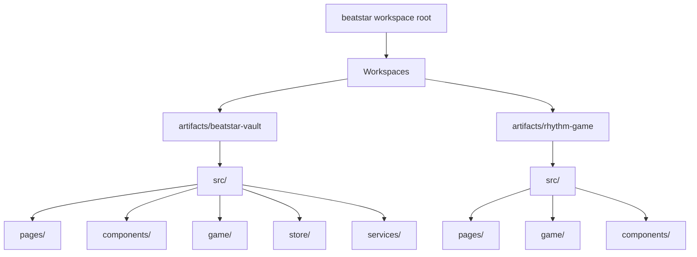
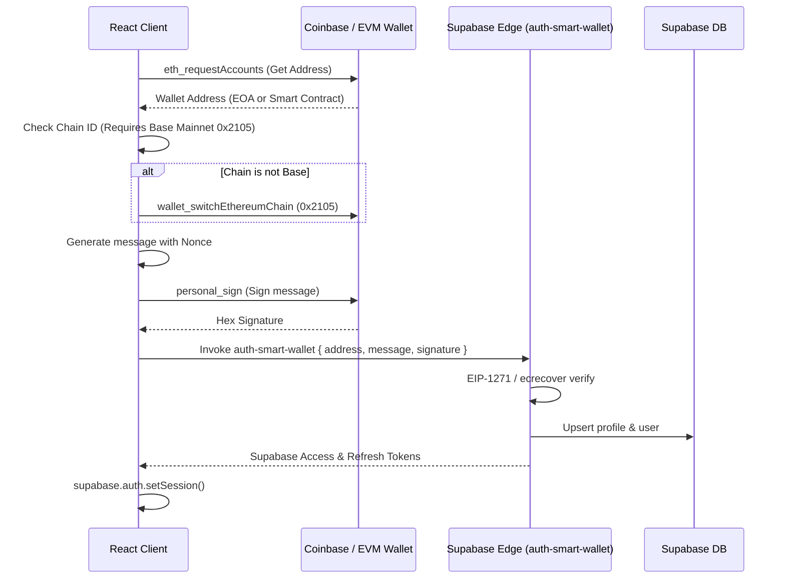
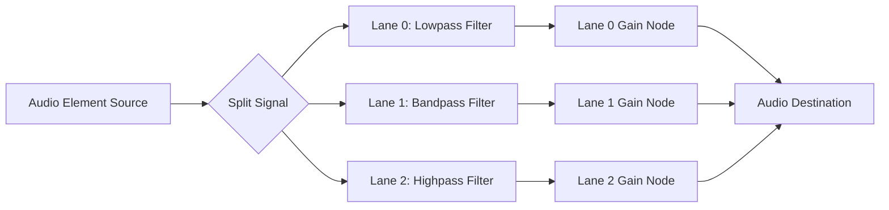
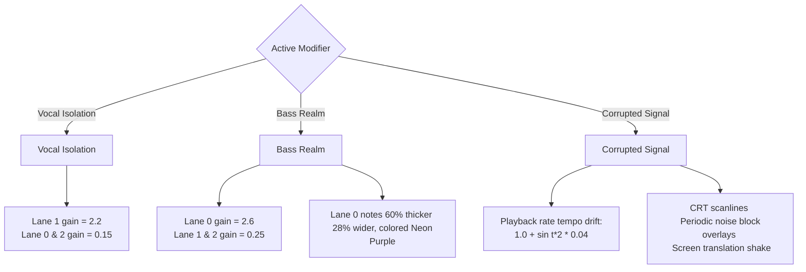
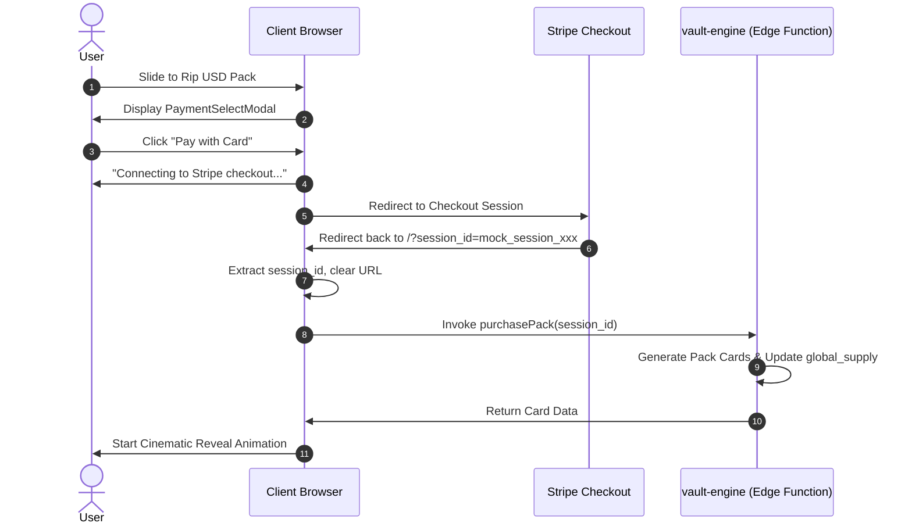

# Project Dossier: th3vault & Beatstar (PIM) Integration

This dossier serves as the comprehensive, authoritative source of truth for **th3vault & Beatstar (PIM) Integration**, a hybrid ecosystem bridging a high-fidelity HTML5 canvas rhythm game and a digital collectible card engine under a unified, premium brutalist cyberpunk aesthetic.

---

## 1. Project Vision & Core Thesis

The project operates under a three-tiered loop designed to maximize user engagement and capture value:

> [!IMPORTANT]
> **The Retention Thesis:**
> **Music Unlocks Gameplay** $\to$ **Gameplay Unlocks Ownership** $\to$ **Ownership Unlocks Status**

1. **Music Unlocks Gameplay**: Fans navigate to the application via deep links (e.g., from TikTok or Spotify) to access a free playable level for the daily song release.
2. **Gameplay Unlocks Ownership**: Reaching specific score and accuracy thresholds on a level awards collectible card packs (Gacha drops) containing card stems and registry proofs.
3. **Ownership Unlocks Status**: Players display their earned collections, showcase streaks, view first-discoverer certifications, and connect external wallets to permanently establish ownership and status.

### The Three Simultaneous Economies
To sustain long-term engagement, the application orchestrates three interlocking value systems:
* **The Skill Economy**: Driven by gameplay accuracy, timing windows, and high scores.
* **The Scarcity Economy**: Powered by global hard supply caps, rarity tiers, and card burning sinks.
* **The Social Economy**: Expressed through collection prestige scores, provenance tracking, and first-discoverer status.

### Product Classification: Systems Product
Moving beyond a simple rhythm prototype or static NFT gallery, the project is classified as an **Experimental Live-Service Platform**. It features server-authoritative transactions, progression currencies, audio-reactive gameplay mutations, and stateful longitudinal player telemetry.

---

## 2. Technical Architecture & Workspace Layout

The codebase is organized as a React + TypeScript monorepo managed with **pnpm workspaces**.



### Core Technologies
- **Client Framework**: React 19, TypeScript
- **Routing**: `wouter` (lightweight routing for React)
- **State Management**: `zustand` (fast, reactive global stores)
- **Styling**: Vanilla CSS + TailwindCSS 4, modern Outfit & Roboto Mono Google Fonts, customized HSL palettes
- **Database & Auth**: Supabase (Auth, RLS, PostgreSQL storage)
- **Animations**: Framer Motion (used for cinematic card reveals, pack opening overlays, and stickers)

### Client Package Configurations
The monorepo contains two primary packages:
1. **`@workspace/beatstar-vault` ([beatstar-vault](file:///Users/studio/BEATSTAR.th3scr1b3.art/beatstar/artifacts/beatstar-vault))**: The primary portal containing the collectible card vault dashboard, Web3 wallet auth, card forge rarity upgrade, duplicate fusion engine, gacha pack shop, and embedded rhythm gameplay engine.
2. **`@workspace/rhythm-game` ([rhythm-game](file:///Users/studio/BEATSTAR.th3scr1b3.art/beatstar/artifacts/rhythm-game))**: A dedicated standalone client package representing the rhythm game component (with campaign chapter maps, stage winding roads, options, calibration offsets, and independent play mode).

### Key Files & Pathways
* **App Shell & Router**: [App.tsx (Vault)](file:///Users/studio/BEATSTAR.th3scr1b3.art/beatstar/artifacts/beatstar-vault/src/App.tsx) | [App.tsx (Rhythm)](file:///Users/studio/BEATSTAR.th3scr1b3.art/beatstar/artifacts/rhythm-game/src/App.tsx)
* **Game Engine Pages**:
  * [GamePlay.tsx (Vault)](file:///Users/studio/BEATSTAR.th3scr1b3.art/beatstar/artifacts/beatstar-vault/src/pages/GamePlay.tsx) | [Game.tsx (Rhythm)](file:///Users/studio/BEATSTAR.th3scr1b3.art/beatstar/artifacts/rhythm-game/src/pages/Game.tsx) (Canvas-based rendering, multi-lane audio splitting, input handler)
  * [GameResults.tsx (Vault)](file:///Users/studio/BEATSTAR.th3scr1b3.art/beatstar/artifacts/beatstar-vault/src/pages/GameResults.tsx) | [Results.tsx (Rhythm)](file:///Users/studio/BEATSTAR.th3scr1b3.art/beatstar/artifacts/rhythm-game/src/pages/Results.tsx) (Accuracy calculations and gacha rewards mapping)
* **Collectibles Core**:
  * [LandingPage.tsx](file:///Users/studio/BEATSTAR.th3scr1b3.art/beatstar/artifacts/beatstar-vault/src/pages/LandingPage.tsx) (Scaled-up dashboard hero & daily card portal)
  * [HomePage.tsx](file:///Users/studio/BEATSTAR.th3scr1b3.art/beatstar/artifacts/beatstar-vault/src/pages/HomePage.tsx) (Main vault landing interface)
  * [PackRevealPage.tsx](file:///Users/studio/BEATSTAR.th3scr1b3.art/beatstar/artifacts/beatstar-vault/src/pages/PackRevealPage.tsx) (Cinematic cards opening animation)
  * [CodexPage.tsx](file:///Users/studio/BEATSTAR.th3scr1b3.art/beatstar/artifacts/beatstar-vault/src/pages/CodexPage.tsx) (Glossary of all 365 daily release cards)
  * [ForgePage.tsx](file:///Users/studio/BEATSTAR.th3scr1b3.art/beatstar/artifacts/beatstar-vault/src/pages/ForgePage.tsx) (Burn cards for tokens, upgrade rarities, and fuse duplicates)
* **Campaign & Chapters**:
  * [Campaign.tsx (Vault)](file:///Users/studio/BEATSTAR.th3scr1b3.art/beatstar/artifacts/beatstar-vault/src/pages/Campaign.tsx) | [Campaign.tsx (Rhythm)](file:///Users/studio/BEATSTAR.th3scr1b3.art/beatstar/artifacts/rhythm-game/src/pages/Campaign.tsx) (Constellation Sector Map UI)
  * [Chapter.tsx (Vault)](file:///Users/studio/BEATSTAR.th3scr1b3.art/beatstar/artifacts/beatstar-vault/src/pages/Chapter.tsx) | [Chapter.tsx (Rhythm)](file:///Users/studio/BEATSTAR.th3scr1b3.art/beatstar/artifacts/rhythm-game/src/pages/Chapter.tsx) (Winding Pathway Level UI + Milestone Rewards bar)
* **API, State & Data Layer**:
  * [api.ts (Vault)](file:///Users/studio/BEATSTAR.th3scr1b3.art/beatstar/artifacts/beatstar-vault/src/game/api.ts) | [api.ts (Rhythm)](file:///Users/studio/BEATSTAR.th3scr1b3.art/beatstar/artifacts/rhythm-game/src/game/api.ts) (Release catalog fetching, local file mappings, and time-lock safety checks)
  * [vaultService.ts](file:///Users/studio/BEATSTAR.th3scr1b3.art/beatstar/artifacts/beatstar-vault/src/services/vaultService.ts) (Card claims, burn/sell logic, upgrade logic, database mappings, and safety fallbacks)
  * [useVaultStore.ts](file:///Users/studio/BEATSTAR.th3scr1b3.art/beatstar/artifacts/beatstar-vault/src/store/useVaultStore.ts) (Global collection, tokens balance, and reveal state)
  * [useAuthStore.ts](file:///Users/studio/BEATSTAR.th3scr1b3.art/beatstar/artifacts/beatstar-vault/src/store/useAuthStore.ts) (Web3 wallet connect and email/anonymous fallback state)
  * [progress.ts (Vault)](file:///Users/studio/BEATSTAR.th3scr1b3.art/beatstar/artifacts/beatstar-vault/src/game/progress.ts) | [progress.ts (Rhythm)](file:///Users/studio/BEATSTAR.th3scr1b3.art/beatstar/artifacts/rhythm-game/src/game/progress.ts) (Medal and high score persistence layer)

---

## 3. Database Schema & Data Flows

The backend is powered by a shared Supabase database with PostgreSQL tables protected by Row Level Security (RLS) rules.

### A. Profiles (`public.profiles`)
Stores account telemetry, wallet bindings, token balance, and streak counts.
```sql
CREATE TABLE public.profiles (
    id UUID PRIMARY KEY REFERENCES auth.users(id) ON DELETE CASCADE,
    username TEXT UNIQUE,
    wallet_address TEXT,
    tokens INT DEFAULT 0,
    daily_standard_claims INT DEFAULT 0,
    daily_premium_claims INT DEFAULT 0,
    last_claim_day INT DEFAULT 0,
    last_free_pack_day INT DEFAULT 0,
    has_onboarded BOOLEAN DEFAULT FALSE,
    streak_count INT DEFAULT 0,
    total_pulls INT DEFAULT 0,
    pulls_since_rare_plus INT DEFAULT 0,
    created_at TIMESTAMPTZ DEFAULT NOW()
);
```

### B. Vault Collections (`public.vault_collections`)
Records owned cards, acquired dates, and gacha origin.
```sql
CREATE TABLE public.vault_collections (
    id UUID PRIMARY KEY DEFAULT gen_random_uuid(),
    owner_id UUID NOT NULL REFERENCES auth.users(id) ON DELETE CASCADE,
    card_id TEXT NOT NULL,
    rarity TEXT NOT NULL CHECK (rarity IN ('common', 'uncommon', 'rare', 'legendary', 'mythic')),
    source TEXT NOT NULL CHECK (source IN ('daily_claim', 'pack_free', 'pack_taste', 'pack_light', 'pack_dark', 'pack_month', 'pack_miss_out', 'pack_special_picks', 'pack_prophecy', 'pack_alpha', 'vault_token', 'targeted_pull', 'fusion')),
    claimed_at TIMESTAMPTZ DEFAULT NOW(),
    edition INT DEFAULT 1,
    max_supply INT DEFAULT 50,
    is_echo BOOLEAN DEFAULT FALSE,
    echo_generation INT DEFAULT 0,
    echo_source_day INT,
    proof TEXT DEFAULT 'none',
    ultra_reward JSONB,
    blockchain_status TEXT DEFAULT 'off-chain',
    CONSTRAINT unique_owner_card_rarity UNIQUE (owner_id, card_id, rarity)
);
```

### C. Gameplay Records (`public.gameplay_records`)
Logs game history and marks earned rewards to prevent double-claiming.
```sql
CREATE TABLE public.gameplay_records (
    id UUID PRIMARY KEY DEFAULT gen_random_uuid(),
    user_id UUID NOT NULL REFERENCES auth.users(id) ON DELETE CASCADE,
    song_id TEXT NOT NULL,
    score INT NOT NULL,
    accuracy NUMERIC(5,2) NOT NULL,
    max_combo INT NOT NULL,
    medal TEXT NOT NULL CHECK (medal IN ('NONE', 'BRONZE', 'SILVER', 'GOLD', 'PLATINUM')),
    pack_rewarded BOOLEAN DEFAULT FALSE,
    reward_tier TEXT NOT NULL CHECK (reward_tier IN ('common', 'enhanced', 'rare', 'epic', 'legendary', 'mythic')),
    timestamp TIMESTAMPTZ DEFAULT NOW()
);
```

### D. Global Supply (`public.global_supply`)
Tracks print numbers of cards globally to enforce hard caps on card availability.
```sql
CREATE TABLE public.global_supply (
    card_id_rarity TEXT PRIMARY KEY, -- Formatted as "{cardId}-{rarity}"
    supply INT DEFAULT 0
);
```

### E. Supabase Edge Functions
Security is enforced by processing all economy and claim transactions server-side inside Deno-based Supabase Edge Functions:
1. **`vault-engine`**:
   - `claimDailyDrop`: Checks daily limits, increments profile claim count, rolls rarity, mints a `vault_collections` entry, and registers edition supply.
   - `purchasePack`: Implements gacha algorithm, evaluates active conditional modifiers, rolls rates, charges tokens, and inserts rolled cards.
   - `burnCard`: Burns/sells a card for tokens. Handles generational Echo variant creation and split payouts securely.
   - `targetedPull`: Deducts 500 V⚡ tokens and awards a specific card.
   - `rarityUpgrade`: Deducts 150 V⚡ tokens and upgrades a card's rarity by 1 tier.
   - `duplicateFusion`: Combines 3 identical cards (same day and rarity) into 1 card of the next tier.
2. **`auth-smart-wallet`**:
   - Verifies Ethereum/EVM signatures (MetaMask personal signs & Coinbase Smart Wallet EIP-1271 signatures) on Base Mainnet to authorize account creation and session establishment.

---

## 4. EVM & Smart Wallet Web3 Authentication

Auth routes users through standard EVM wallets or the Coinbase Smart Wallet using signature-based authorization constraints, designed with a **progressive decentralization** strategy.



### Core Configuration
- **Network**: **Base Mainnet (Chain ID `8453` / Hex `0x2105`)**
- **RPC URL**: `https://mainnet.base.org`
- **Block Explorer**: `https://base.blockscout.com`

### Authentication Flow
1. **Wallet Initialization**: If no standard browser wallet extension (`window.ethereum`) is found, the system initializes **Coinbase Wallet SDK v4** using `makeWeb3Provider()`.
2. **Base Network Enforcement**: The client verifies the current chain. If it is not Base, it requests a switch (`wallet_switchEthereumChain`) or registers the network configuration (`wallet_addEthereumChain`).
3. **Personal Sign Challenge**: The client requests a signature for:
   `"Sign in to th3vault on Base. Nonce: {Date.now()}"`
4. **Signature Verification**: The address, message, and signature are sent to the `auth-smart-wallet` edge function.
   - **EOA (External Owned Accounts)**: Verified via standard `ecrecover` parameters.
   - **Smart Contracts (Coinbase Smart Wallet)**: Verified using **EIP-1271** (`isValidSignature` call against the contract wallet address), enabling gasless smart wallets to sign in.
5. **Session Creation**: If valid, the edge function returns a Supabase JWT session, which the client consumes to log in.

---

## 5. Rhythm Gameplay & Canvas Render Engine

Gameplay rendering operates via an HTML5 Canvas drawing loop triggered by `requestAnimationFrame`, projecting descending note coordinates onto a perspective 3D highway.

### 1. Approach Time Scaling
The speed at which notes travel from the horizon to the hit line scale dynamically with the difficulty level. Easier levels are slow and forgiving; hard levels are rapid.
$$\text{Approach Time (seconds)} = \max(1.35, 2.5 - (\text{Difficulty Level} - 1) \times 0.128)$$

### 2. Perspective Geometry Mapping
The perspective highway maps notes from 3D space onto the 2D canvas. The progression $P$ of a note (where $P = 0$ is the horizon, and $P = 1.0$ is the hit line) maps the screen Y coordinate:
$$Y_{\text{note}} = Y_{\text{top}} + (Y_{\text{bottom}} - Y_{\text{top}}) \times P$$
Lanes are segmented into 3 tracks:
- **Lane 0 (Bass)**: Rendered on the Left. Under the **Bass Realm** modifier, Lane 0 notes are rendered **60% thicker**, **28% wider**, and styled with a glowing neon purple accent (`#a855f7`).
- **Lane 1 (Mids)**: Rendered in the Center.
- **Lane 2 (Treble)**: Rendered on the Right.

### 3. Note Types
* **Taps**: Single-hit circular targets.
* **Swipes**: Gated by difficulty levels (unlocked at Level 4+). Checked by touch/swipe vectors to match direction (`left`, `right`, `up`, `down`, `up-left`, `up-right`, `down-left`, `down-right`).
* **Holds & Slides**: Gated by difficulty levels (unlocked at Level 7+). Requires holding and tracking notes across lanes. The visual position of a slide note moves smoothly between lanes using linear interpolation:
  $$\text{visualLane} = \text{lerp}(\text{visualLane}, \text{currentLane}, 0.18)$$

### 4. Timing Windows & Judgment
Timing window tolerances scale down as difficulty increases, raising accuracy standards:

| Judgment | Timing Window Formula (Seconds) | Base Score |
| :--- | :--- | :--- |
| **Perfect+** | $\le \max(0.030, 0.060 - (\text{diff} - 1) \times 0.0033)$ | 500 points |
| **Perfect** | $\le \max(0.055, 0.110 - (\text{diff} - 1) \times 0.0061)$ | 300 points |
| **Good** | $\le \max(0.100, 0.190 - (\text{diff} - 1) \times 0.010)$ | 150 points |
| **Miss** | $> \max(0.190, 0.360 - (\text{diff} - 1) \times 0.019)$ | 0 points (Resets Combo) |

### 5. Difficulty Combo Multipliers
The active score multiplier caps are determined by track difficulties:
- **LIGHT (Level 1-3)**: Cap of 3x.
  - $\text{Combo} < 10 \to 1\times$ | $\text{Combo} < 25 \to 1.5\times$ | $\text{Combo} < 50 \to 2\times$ | $\text{Combo} \ge 50 \to 3\times$
- **DARK (Level 4-6)**: Cap of 4x.
  - $\text{Combo} < 10 \to 1\times$ | $\text{Combo} < 25 \to 1.5\times$ | $\text{Combo} < 50 \to 2\times$ | $\text{Combo} < 75 \to 3\times$ | $\text{Combo} \ge 75 \to 4\times$
- **VOID (Level 7-10)**: Cap of 5x.
  - $\text{Combo} < 10 \to 1\times$ | $\text{Combo} < 25 \to 1.5\times$ | $\text{Combo} < 50 \to 2\times$ | $\text{Combo} < 75 \to 3\times$ | $\text{Combo} < 100 \to 4\times$ | $\text{Combo} \ge 100 \to 5\times$

### 6. Power-Up Overlays (Flow-State Amplification)
Maintaining high combos unlocks dynamic states, inducing flow-state synchronization with the music:
- **FEVER (Combo $\ge 20$)**: 9-second duration. Score multiplier is 2x. Upgrades all standard `PERFECT` hits to `PERFECT+` automatically. Styled in gold (`#E5B800`).
- **SURGE (Combo $\ge 40$)**: 11-second duration. Score multiplier is 3x. **Autoplay Mode**: Automatically grabs hold notes and tracks slide paths, synchronizing the player with the visual structure. Styled in hot pink (`#FF1493`).
- **SIGNAL LOCK (Combo $\ge 60$)**: 14-second duration. Score multiplier is 4x. Styled in neon green (`#39FF14`).

### 7. Death & Continue System
- **Miss Limit**: Accumulating 3 misses triggers a failure state.
- **Rewind Logic**: The engine pauses and rewinds the audio track by 2.5 seconds.
- **Continues**: A user can continue up to **3 times** per song. Rrying a continue decreases the remaining continue count, resets the miss count, and triggers a backward scroll animation:
  - Renders the perspective highway in reverse over 1.2 seconds (`1200ms`).
  - Restores notes missed in the rewind window (`note.time >= rewindTo - 0.5`).
  - Resets combo to 0 and un-silences all audio lanes.

---

## 6. Split-band Audio & Lane Muting Subsystem

The game feeds physical performance accuracy back to the user through real-time audio channel filtering, creating **performance-driven adaptive music degradation (Sonic Punishment)**.



### Frequency Band Routing
The master track audio is fed through a 3-way crossover split utilizing Web Audio API `BiquadFilterNode` routing:
- **Lane 0 (Bass)**: Connected to a `lowpass` filter. Frequency: `300 Hz` | Q-factor: `0.8`.
- **Lane 1 (Mids)**: Connected to a `bandpass` filter. Frequency: `1200 Hz` | Q-factor: `0.7`.
- **Lane 2 (Treble)**: Connected to a `highpass` filter. Frequency: `3200 Hz` | Q-factor: `0.8`.

### Adaptive Sonic Muting & Recovery
Unlike typical rhythm games that punish misses purely visually or numerically, PIM degrades the audio quality itself. Missing the treble components silences the highpass frequency; missing the bass hollows out the track. This builds sub-conscious lane-association and deep sensory immersion:
- **Muting on Miss**: Ramps the gain node of the missed lane down to a quiet audibility threshold of `0.04` over `0.12 seconds` (`linearRampToValueAtTime`).
- **Active Restore on Hit**: Striking a note in a muted lane instantly un-silences that band, ramping the gain back to its target level over `0.25 seconds`.
- **Passive Restore (Auto-Recovery)**: If a lane is muted and the player fails to strike a note, the system automatically restores the lane's gain back to its target level after a `3.5-second` (3500ms) safety window, ramping it up over `0.4 seconds` (crossover filter smoothing).

### Autoplay Policy Warm-Up
To prevent mobile browser blockages (Safari/Chrome autoplay policies blocking audio on game start after the 3-second countdown):
- During the first navigation gesture, the app calls `play()` on the audio element, followed immediately by `pause()` and a reset of `currentTime = 0`. This marks the media element as "user-unlocked," allowing the game engine to play audio successfully after the countdown.

---

## 7. Codex, Previews & Active Modifiers

The collectible cards interact directly with audio previews, song details, and gameplay mechanics.

### 1. Codex Sorting & Filtering
The Codex houses the 365 daily releases, supporting multi-tier organization:
- **Sort Modes**: `day-asc` (chronological), `day-desc` (reverse chronological), `rarity` (highest rarity owned first).
- **Filter Modes**:
  - `all`: Displays past released cards plus owned future cards.
  - `owned`: Displays only cards present in the user's vault collections.
  - `missing`: Displays released cards not currently owned.
  - `beyond`: Displays future locked cards that the player won early from Prophecy packs.

### 2. Audio Preview Constraints
If a user does not own a card in their collection, they are subject to audio preview duration restrictions when browsing the Codex or Song Select screens:
- **Common Cards**: 15 seconds audio preview.
- **Uncommon Cards**: 60 seconds (1 minute) audio preview.
- **Rare, Legendary, & Mythic Cards**: Unlimited/Full song preview.
- **Daily Claim Card**: Unlimited/Full song preview regardless of rarity.
- **Mythic Stems**: Owning Mythic cards unlocks raw session stems downloading for custom remixing.

### 3. Active Gameplay Modifiers
Equipping owned cards modifies song parameters, altering lane volume gains and visual rendering:



- **Vocal Isolation**:
  - *Trigger*: Tag/genre matches Pop, Indie, Acoustic, Ambient, R&B, Soul, or BPM $\le 100$.
  - *Audio*: Boosts vocal channels while dampening others (Lane 1 Mids gain = 2.2, Lane 0 Bass gain = 0.15, Lane 2 Treble gain = 0.15).
- **Bass Realm**:
  - *Trigger*: Tag/genre matches Electro, Dance, Hip-Hop, Trap, Techno, Dubstep, House, or BPM $> 120$.
  - *Audio & Visual*: Amplifies low-end frequencies (Lane 0 gain = 2.6, Lane 1 & 2 gain = 0.25). Lane 0 notes are styled as neon purple (`#a855f7`), 60% thicker, and 28% wider.
- **Corrupted Signal**:
  - *Trigger*: Title contains "crash", "overflow", "fault", "lock", "decay", or tag matches Glitch, Noise, Corrupted, Industrial, or BPM $> 138$.
  - *Audio & Visual*: Drives pitch/tempo oscillations ($\pm 4\%$ drift on playback rate: `1.0 + Math.sin(t * 2.0) * 0.04`). The canvas translates randomly (7% chance per frame of horizontal offset up to $\pm 7\text{px}$), overlaying CRT scanlines every 4px and horizontal orange noise blocks.

---

## 8. Admin Config & Gacha Simulation (Economy Rebalance v2.1)

Ecosystem rates are configured in `admin_config` (synchronized via the `vault-engine` edge function) and cached in `localStorage` under `th3vault_admin_config`.

### 1. Velocity-Balanced Supply Structure
Because PIM transitions the ecosystem from an *occasional gacha pull* model to a *repeatable skill-driven gameplay farming loop*, static scarce caps on low-tier cards risk exhausting supply immediately during traffic spikes (creating onboarding bottlenecks).

The supply cap architecture diverges between **Playable Copies** (free gameplay progression, non-tradeable) and **Mintable Copies** (on-chain ownership cards, tradeable on Base) to ensure players are never locked out of progression, while collectors maintain absolute digital rarity:

| Rarity Tier | Old Static Cap | New Gameplay Copy Cap | New Mintable Cap | Token Burn Value |
| :--- | :--- | :--- | :--- | :--- |
| **Common** | 50 | 2,000 | 0 (Off-chain) | 3 tokens |
| **Uncommon** | 20 | 500 | 50 | 10 tokens |
| **Rare** | 10 | 100 | 25 | 30 tokens |
| **Legendary** | 2 | 10 | 3 | 80 tokens |
| **Mythic** | 1 | 1 | 1 | 200 tokens |

### 2. Time-Based Archival Supply Expansion
Instead of hard static caps forever, daily releases implement time-expanding caps to preserve early adopter prestige while preventing late-comers from being permanently locked out of archival content:
- **Launch Week (Day 0–7)**: Common cap = `250` | Uncommon cap = `100` | Rare cap = `15` | Legendary cap = `2`.
- **Month 1 (Day 30+)**: Common cap expands to `500` | Uncommon to `250` | Rare to `35` | Legendary to `3`.
- **Month 6 (Day 180+)**: Common cap expands to `1000` | Uncommon to `500` | Rare to `50` | Legendary to `5`.

### 3. Dynamic Legendary Classes
Rather than a flat cap of 2, Legendary scarcity is contextually class-divided to enhance narrative significance:
- **Daily Legendary**: Supply = `5` (rolled from standard and mood gacha packs).
- **Event Legendary**: Supply = `3` (issued during calendar milestones and chapter completions).
- **Founder Legendary**: Supply = `2` (initial print runs for early community adopters).
- **First Discoverer Legendary**: Supply = `1` (awarded exclusively to the first player to achieve a Platinum medal on a daily release).

### 4. Echo Generation & Generational Prestige Decay
Packs have a **15% chance** to roll an **Echo card variant**. Burning Echo cards splits their payout (50% tokens, 50% Echo Prestige). To prevent infinite recursive token farming, the Echo card decays across generations, reducing token yields until entropy death:
- **Gen 0 Echo Spawn**: 25% rate (original burn value).
- **Gen 1 Echo Spawn**: 15% rate (0.6x burn value multiplier).
- **Gen 2 Echo Spawn**: 8% rate (0.3x burn value multiplier).
- **Gen 3+ Echo Spawn**: 0% rate (0.1x burn value multiplier) — *Entropy Death limit*.

### 5. Global Prestige Scoring
Global Prestige determines player status on the leaderboard. The algorithm rewards consistency, participation, and archival significance rather than just token wealth:
$$\text{Prestige Score} = (\text{Streak Count} \times 120) + (\text{Total Pulls} \times 15) + \sum \text{Card Rarity Points} + \sum \text{Bonuses}$$
*Bonuses:* First edition card owned = $+500$ | Proof card owned = $+200$ | Echo card owned = $+400$.

### 6. Daily Gacha Limits & Sinks
- **Daily Standard Packs Pull Limit**: 60 pulls/day (elevated from 30 in V2 RC1).
- **Daily Premium Packs Pull Limit**: 5 pulls/day (elevated from 2 in V2 RC1).
- **Drought Pity Protection**: Guaranteed Rare+ floor triggers after **25 consecutive pulls** with no Rare or higher cards drawn.
- **V2 Token Sinks**:
  - *Targeted Pull*: Choose any daily card for 500 V⚡ tokens.
  - *Rarity Upgrade*: Upgrade any owned card by 1 tier for 150 V⚡ tokens.
  - *Duplicate Fusion*: Combine 3 identical cards (same day and rarity) into 1 card of the next tier.

### 7. Conditional Admin Modifiers
The engine supports conditional modifiers, dynamically adjusting rates based on user context:
- `streak_reward` (7+ login streak): $+50\%$ Rare & Legendary rates.
- `midnight_drop` (12am–2am clock): 2x Legendary chances.
- `drought_protection` (20+ pulls with no Rare+): Guaranteed Rare card floor.
- `collector_milestone` (100+ unique cards): $+25\%$ to Rare, Legendary, and Mythic rates.
- `first_pack_luck` (new user's first pack): Guaranteed Uncommon card floor.
- `weekend_bonus` (Saturday & Sunday): $+30\%$ Rare & Legendary rates.
- `lucky_seven` (days ending in 7): 2x Mythic chance.
- `burn_streak` (10+ burns today): $+1$ bonus card on next pull.
- `codex_completionist` (50%+ Codex completion): 1.5x token earn multiplier.

---

## 9. User Identity & Stripe Payment Integration

To support users without crypto wallets, the platform integrates standard Email/Password authentication coupled with an automated local ephemeral wallet structure, alongside Stripe card checkouts.

### 1. Identity Classes & Onboarding
- **EVM Wallet Mode**: Connects via MetaMask or Coinbase Smart Wallet (EIP-1271).
- **Email/Password Mode**: Managed via Supabase Auth.
  - On Registration: The client generates an ephemeral wallet (private key + address). The address is written to the user's `profiles.wallet_address` and Supabase Auth user metadata (`wallet_address`). The private key is saved securely in a user-scoped localStorage key (`th3vault_ephemeral_wallet_pkey_${userId}`) and set active.
  - On Login: The client checks the database for a linked `wallet_address`. If the private key is missing locally (e.g., logging in from a new device), the client generates a new ephemeral wallet, overwriting the database/metadata with the new address to ensure transaction capabilities.

### 2. Stripe Checkout Intercept Sequence
Packs purchased with USD value (Prophecy, Alpha, Special Picks) support debit/credit card fallbacks:
1. Purchasing a USD pack intercepts the flow and triggers `PaymentSelectModal`.
2. Selecting **Card** launches a mock Stripe Checkout redirect loader.
3. The page shifts `window.location.href` to `/?session_id=cs_live_mock_[id]&category=[category]&size=[size]`.
4. On redirect reload, the client intercepts the `session_id`, clears search parameters, and sends the session ID to the `vault-engine` Deno Edge function to finalize pack generation.



---

## 10. Quality & Performance Maintenance Wins

Key fixes deployed in the current releases maintain platform stability:

1. **Time-Lock Lockout Resolution**: Patched the date comparison in `isSongTimeLocked` to check if a song's day count is less than or equal to the current vault day. This solved the critical bug where timezone mismatches caused the game to silently redirect users away on launch.
2. **Authentication Pollution Fix**: Suppressed default initialization auth logs to warnings, preserving the wallet "Connect Wallet" button state instead of defaulting to a red "Retry Connect" failure if Supabase Anonymous Auth isn't active on a host.
3. **Defensive Fallback & Security**: Built safe defaults (`getSafeFallbackCard` / `findCardWithFallback`) to ensure database lookups never crash the client if the release cache or DB connection fails.
4. **Defensive Date Split Parsing**: All date splits are guarded (`date?.split('/')`) to prevent page-level crashes when sorting February chapters or incomplete campaign listings.
5. **Progress Logic Synchronicity**: Progression is calculated using unique song IDs with an earned medal OR a high score $>0$, aligning map highlights with level indicators.
6. **sessionStorage Refresh Safety**: Score formatting on the Results page uses `(result?.score ?? 0).toLocaleString()`, preventing crashes if the session storage cache is cleared during page refreshes.
7. **Array Index Bounds**: Winding pathway rendering loops in `Chapter.tsx` check boundary limits to avoid reading empty indexes.

---

## 11. Strategic System Appraisal & Future Roadmap

To address systems creep as the project moves into the *Experimental Live-Service Platform* tier, the architecture details several major design patterns for future implementation:

### 1. Layered UX Onboarding Strata
To manage cognitive complexity and avoid freezing players with a massive array of systems on day one, the interface will segment features into four distinct onboarding tiers:

```
+-------------------------------------------------------------+
| Casual: Play rhythm tracks + standard gacha pack opening     |
+-------------------------------------------------------------+
                              |
                              v
+-------------------------------------------------------------+
| Regular: Daily login streaks + Codex completion progress     |
+-------------------------------------------------------------+
                              |
                              v
+-------------------------------------------------------------+
| Collector: Card targeted pulls + Forge rarity upgrades      |
+-------------------------------------------------------------+
                              |
                              v
+-------------------------------------------------------------+
| Hardcore: Prestige optimization + Echo entropy loops         |
+-------------------------------------------------------------+
```

### 2. Tiered Emotional Loop Archetypes
Scarcity caps map to specific player emotions to ensure structural engagement:
- **Common (Gameplay Copy = 2000)**: *“I’m progressing.”* (Onboarding retention, codex filler, fusion fodder, burn fuel).
- **Uncommon (Gameplay Copy = 500)**: *“I’m building identity.”* (Deck customization, profile satisfaction, deck flexing).
- **Rare (Gameplay Copy = 100)**: *“I got lucky.”* (Controlled drop rates, satisfying high accuracy plays).
- **Legendary (Gameplay Copy = 10)**: *“Holy shit.”* (Social status flex, milestone rewards, extreme prestige boosters).
- **Mythic (Gameplay Copy = 1)**: *“This is history.”* (Absolute rarity, discoverer certification, permanent blockchain prestige).

### 3. Circulation & Destruction Velocity Telemetry Spec
Rather than viewing supply as a fixed pool, telemetry hooks will track the ecosystem's velocity similar to complex in-game economies (e.g. Counter-Strike, Path of Exile):
- **Gameplay-to-Mint Conversion Ratio**: Speed at which off-chain gameplay copies are minted onto Base.
- **Velocity Tracking**: Average daily pull rates, circulation volume, card burn destruction rates, and active token sinks balance.
- **Pity Trigger Frequencies**: Monitoring how often the 25-pull Rare+ floor triggers to maintain drop rate balance.

### 4. Provenance Memory Implementation
To increase emotional attachment, cards will evolve from digital records to historical artifacts by writing permanent records into the metadata when players reach milestones:
- **First Discoverer**: Wallet binding/username of the first player to pull/claim a specific day's card.
- **Fastest Platinum**: The user who completes the corresponding song's platinum medal with the lowest absolute timing error.
- **Historical Timestamps**: Early mint numbers mapped directly to the card's visual card face.

### 5. Async Social Ghosts
Utilizing the gameplay telemetry records, the system will support asynchronous player interactions:
- **Replay Ghosts**: Recreating another player's notes hit/miss timeline on the canvas as a semi-transparent runner.
- **Lane Heatmaps**: Rendering visual indicators showing where players struggle on specific notes.
- **Spectral Skill Fingerprints**: Fingerprinting player accuracy profiles to generate matches for asynchronous PvP challenges.

### 6. The Living Vault Ecosystem Spec (Fragmented Cards & Hidden Paths)
The background rendering ecosystem evolves into an interactive, visual representation of the player's collection status:
- **Fragmented Card Shards**: 
  - For songs where the player has accrued $< 10$ fragments, the vault background displays floating, glitching HSL card fragments drifting along parallax vectors.
  - The physical alignment and glowing transparency of these shards scale dynamically with the user's current fragment count (`fragmentCount / 10`). At $9$ fragments, the card is visually assembled but flickering; upon decrypting the $10\text{th}$ fragment, it crystallizes into a solid card model on the shelves.
- **Hidden Neural Pathways**:
  - The background camera tracks along branching concrete corridors in the Vault.
  - Owning key legendary cards, event credentials, or reaching high prestige milestone scores unlocks "security overrides."
  - When overrides occur, hidden hydraulic doors slides open in the canvas background, displaying secret server wings, locked audio chambers, or portal Deep Links to secret avant-garde levels.

