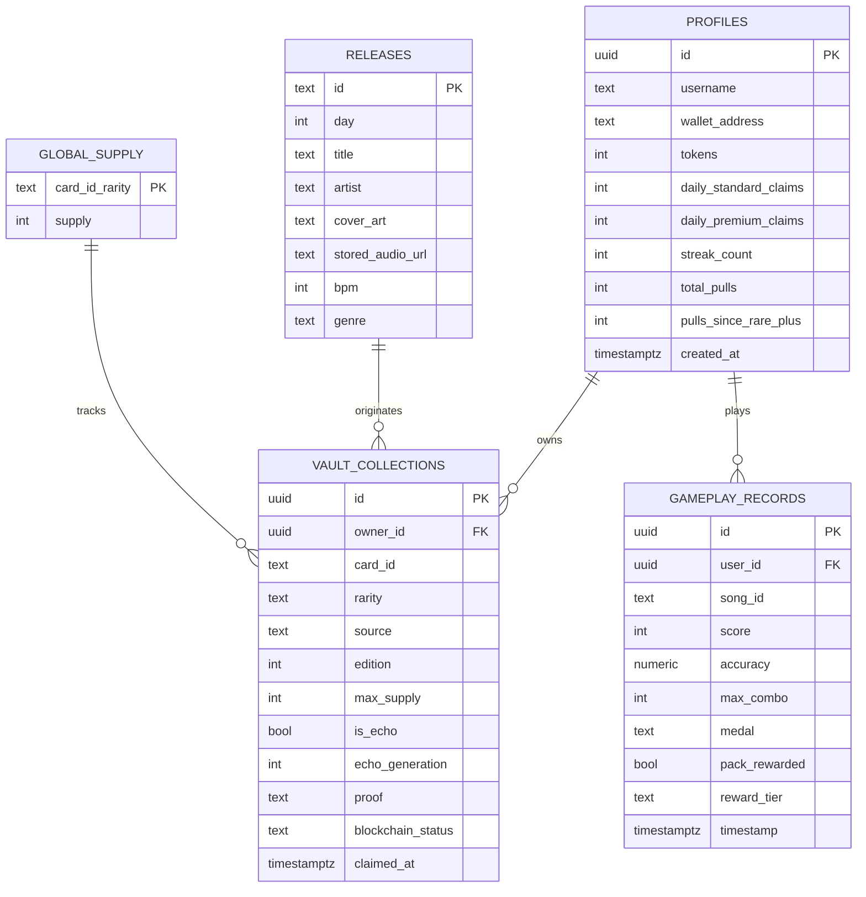
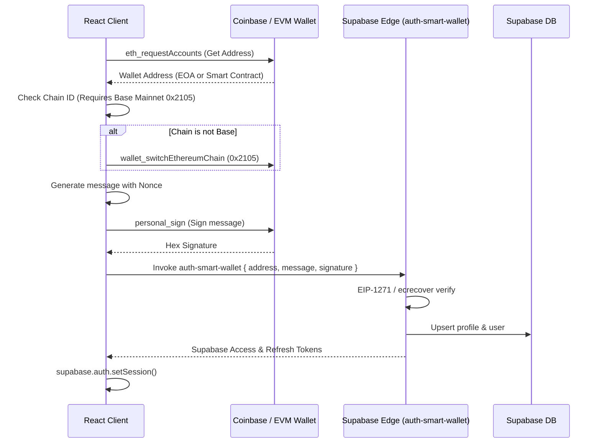

# Project Dossier: PIM : th3v4ult - poetry in motion

This dossier serves as the comprehensive, authoritative source of truth and master technical specification for **PIM : th3v4ult - poetry in motion**, a hybrid live-service ecosystem bridging a high-precision HTML5 canvas rhythm game, an audio-reactive collectible card engine, and decentralized ownership on Base EVM under a unified, technical brutalist cyberpunk aesthetic.

---

## 1. Project Vision & Core Thesis

The project operates under a three-tiered loop designed to maximize user engagement, convert music discovery into recurring gameplay, and capture long-term collector value:

> [!IMPORTANT]
> ### The Retention Thesis
> $$\textbf{Music Unlocks Gameplay} \longrightarrow \textbf{Gameplay Unlocks Ownership} \longrightarrow \textbf{Ownership Unlocks Status}$$

> [!CAUTION]
> ### CRITICAL DEVELOPMENT WORKFLOW DIRECTIVE: BEATSTAR-VAULT IS PRIMARY
> 1. **Primary Target (`@workspace/beatstar-vault`)** at `artifacts/beatstar-vault`:
>    - ALL feature development, bug fixes, UI/UX polish, rhythm engine updates, database logic, gacha tuning, audio DSP filters, and documentation MUST occur first in **`artifacts/beatstar-vault`**.
>    - `beatstar-vault` is the single source of truth and primary live-service client application.
> 2. **Secondary Target (`@workspace/rhythm-game`)** at `artifacts/rhythm-game`:
>    - Standalone rhythm client package. Only sync features, maps, tutorials, or fixes back to `rhythm-game` **AFTER** they have been fully built, tested, and validated in `beatstar-vault`.

1. **Music Unlocks Gameplay**: Fans navigate to the application via deep links (e.g., from TikTok, Spotify, or social channels) to access a free playable arcade level for each daily song release (365 unique songs total—one for every day of the calendar year).
2. **Gameplay Unlocks Ownership**: Achieving performance accuracy and score thresholds on a level awards collectible card packs (Gacha drops) containing card session stems, cryptographic registry proofs, and card burn assets.
3. **Ownership Unlocks Status**: Players showcase their earned collections, maintain daily streaks, unlock first-discoverer certifications, forge cards to elevate prestige scores, and connect external Web3 wallets to permanently establish on-chain ownership on Base Mainnet.

### The Three Interlocking Economies
To sustain long-term engagement and economic balance, the application orchestrates three simultaneous value systems:
* **The Skill Economy**: Governed by millisecond timing windows, swipe precision, hold ribbon tracking, unbroken combo multipliers (up to $5\times$), and adaptive audio degradation.
* **The Scarcity Economy**: Powered by global hard supply caps, rarity tiers (Common $\to$ Mythic), mintable vs. gameplay copy splits, and card burning sinks.
* **The Social Economy**: Expressed through collection prestige scores, global leaderboard telemetry, replay ghosts, and 1-of-1 First Discoverer gold stamps.

### Product Classification: Live-Service Systems Platform
Moving beyond a simple rhythm prototype or static NFT gallery, the project is classified as an **Experimental Live-Service Platform**. It features server-authoritative transactions, progression currencies ($V\text{⚡}$ tokens), audio-reactive gameplay mutations (Vocal Isolation, Bass Realm, Corrupted Signal), and stateful longitudinal player telemetry.

---

## 2. Technical Architecture & Monorepo Layout

The codebase is organized as a React 19 + TypeScript monorepo managed with **pnpm workspaces** (`pnpm-workspace.yaml`).

```mermaid
graph TD
    Root[beatstar workspace root] --> Workspaces[pnpm Workspaces]
    Workspaces --> BV[artifacts/beatstar-vault (Primary Source of Truth)]
    Workspaces --> RG[artifacts/rhythm-game (Secondary Standalone Client)]
    Workspaces --> API[artifacts/api-server (Express API Server)]
    Workspaces --> MOCK[artifacts/mockup-sandbox (Visual Sandbox)]
    Workspaces --> LIB[lib/]
    
    LIB --> CONTRACTS[lib/contracts (Solidity Smart Contracts / Hardhat)]
    LIB --> DB[lib/db (Drizzle ORM & Supabase DB Client)]
    LIB --> SPEC[lib/api-spec (OpenAPI Specifications)]
    LIB --> ZOD[lib/api-zod (Zod Validation Schemas)]
    LIB --> CLIENT[lib/api-client-react (React Query Hooks)]
    
    Root --> SUPA[supabase/ (Migrations & Deno Edge Functions)]
    SUPA --> EF1[vault-engine]
    SUPA --> EF2[auth-smart-wallet]
    SUPA --> EF3[stripe-webhook]
```

### Core Technologies
- **Client Framework**: React 19, TypeScript, Vite 7
- **Routing**: `wouter` (lightweight declarative routing for React)
- **State Management**: `zustand` (fast, reactive global stores for vault, audio, rhythm, and auth state)
- **Styling**: Vanilla CSS + TailwindCSS 4, modern Outfit & Roboto / JetBrains Mono typography, custom HSL design tokens
- **Animations**: Framer Motion (used for cinematic card reveals, pack opening overlays, stickers, and page transitions)
- **Audio & Rendering**: Web Audio API (3-way crossover split filters) + HTML5 2D Canvas 60fps rendering highway
- **Database & Auth**: Supabase (PostgreSQL with RLS, Auth, Deno Edge Functions)
- **Blockchain / Smart Contracts**: Base Mainnet (Chain ID `8453` / `0x2105`), Coinbase Smart Wallet (EIP-1271), Hardhat, OpenZeppelin ERC-721 (`PIM.sol`)
- **Desktop Runtime**: Tauri 2.0 (`art.th3scr1b3.pim`)

### Package Directory Breakdown
1. **`@workspace/beatstar-vault` ([beatstar-vault](file:///Users/studio/BEATSTAR.th3scr1b3.art/beatstar/artifacts/beatstar-vault))**:
   - The primary live portal containing the collectible card vault dashboard, Web3 wallet auth, card forge rarity upgrade, duplicate fusion engine, gacha pack shop, pitch deck presentation, beatmap editor, listen jukebox, voyeur telemetry, and embedded rhythm gameplay engine.
2. **`@workspace/rhythm-game` ([rhythm-game](file:///Users/studio/BEATSTAR.th3scr1b3.art/beatstar/artifacts/rhythm-game))**:
   - A dedicated standalone client package representing the rhythm game component (with campaign chapter maps, stage winding roads, interactive tutorial, options, calibration offsets, passkey auth, and independent play mode).
3. **`artifacts/api-server`**:
   - Backend Express + TypeScript server supporting custom data endpoints, middleware, and database connections.
4. **`lib/contracts`**:
   - Hardhat development suite with Solidity contracts (`PIM.sol`), Cancun EVM configuration, Base network bindings, and automated tests.
5. **`lib/db`**:
   - Shared database definitions, Drizzle ORM schema mapping, and client initializers.
6. **`lib/api-spec`, `lib/api-zod`, `lib/api-client-react`**:
   - Contract-first API specifications, runtime Zod validators, and generated React Query client hooks.

### Key Files & Pathways
* **App Shell & Router**: [App.tsx (Vault)](file:///Users/studio/BEATSTAR.th3scr1b3.art/beatstar/artifacts/beatstar-vault/src/App.tsx) | [App.tsx (Rhythm)](file:///Users/studio/BEATSTAR.th3scr1b3.art/beatstar/artifacts/rhythm-game/src/App.tsx)
* **Game Engine Pages**:
  * [GamePlay.tsx (Vault)](file:///Users/studio/BEATSTAR.th3scr1b3.art/beatstar/artifacts/beatstar-vault/src/pages/GamePlay.tsx) | [Game.tsx (Rhythm)](file:///Users/studio/BEATSTAR.th3scr1b3.art/beatstar/artifacts/rhythm-game/src/pages/Game.tsx) (Canvas-based rendering, 3-band audio splitting, note input handler)
  * [GameResults.tsx (Vault)](file:///Users/studio/BEATSTAR.th3scr1b3.art/beatstar/artifacts/beatstar-vault/src/pages/GameResults.tsx) | [Results.tsx (Rhythm)](file:///Users/studio/BEATSTAR.th3scr1b3.art/beatstar/artifacts/rhythm-game/src/pages/Results.tsx) (Accuracy calculations and gacha rewards mapping)
  * [Tutorial.tsx](file:///Users/studio/BEATSTAR.th3scr1b3.art/beatstar/artifacts/rhythm-game/src/pages/Tutorial.tsx) (Interactive step-by-step game tutorial)
  * [Options.tsx](file:///Users/studio/BEATSTAR.th3scr1b3.art/beatstar/artifacts/rhythm-game/src/pages/Options.tsx) (Keybind configuration, audio offset calibration, miss limit toggle)
* **Collectibles Core**:
  * [LandingPage.tsx](file:///Users/studio/BEATSTAR.th3scr1b3.art/beatstar/artifacts/beatstar-vault/src/pages/LandingPage.tsx) (Scaled-up dashboard hero & daily card portal)
  * [HomePage.tsx](file:///Users/studio/BEATSTAR.th3scr1b3.art/beatstar/artifacts/beatstar-vault/src/pages/HomePage.tsx) (Main vault landing interface)
  * [PackRevealPage.tsx](file:///Users/studio/BEATSTAR.th3scr1b3.art/beatstar/artifacts/beatstar-vault/src/pages/PackRevealPage.tsx) (Cinematic cards opening animation)
  * [CodexPage.tsx](file:///Users/studio/BEATSTAR.th3scr1b3.art/beatstar/artifacts/beatstar-vault/src/pages/CodexPage.tsx) (Glossary of all 365 daily release cards)
  * [ForgePage.tsx](file:///Users/studio/BEATSTAR.th3scr1b3.art/beatstar/artifacts/beatstar-vault/src/pages/ForgePage.tsx) (Burn cards for tokens, upgrade rarities, and fuse duplicates)
  * [CardDesignShowcase.tsx](file:///Users/studio/BEATSTAR.th3scr1b3.art/beatstar/artifacts/beatstar-vault/src/pages/CardDesignShowcase.tsx) (Visual showcase of all card design tiers and holographic foils)
* **Campaign & Chapters**:
  * [Campaign.tsx (Vault)](file:///Users/studio/BEATSTAR.th3scr1b3.art/beatstar/artifacts/beatstar-vault/src/pages/Campaign.tsx) | [Campaign.tsx (Rhythm)](file:///Users/studio/BEATSTAR.th3scr1b3.art/beatstar/artifacts/rhythm-game/src/pages/Campaign.tsx) (Constellation Sector Map UI)
  * [Chapter.tsx (Vault)](file:///Users/studio/BEATSTAR.th3scr1b3.art/beatstar/artifacts/beatstar-vault/src/pages/Chapter.tsx) | [Chapter.tsx (Rhythm)](file:///Users/studio/BEATSTAR.th3scr1b3.art/beatstar/artifacts/rhythm-game/src/pages/Chapter.tsx) (Winding Pathway Level UI + Milestone Rewards bar)
* **Creation & Platform Tools**:
  * [BeatmapEditor.tsx](file:///Users/studio/BEATSTAR.th3scr1b3.art/beatstar/artifacts/beatstar-vault/src/pages/BeatmapEditor.tsx) (Interactive visual beatmap creation and editing suite)
  * [AdminPage.tsx](file:///Users/studio/BEATSTAR.th3scr1b3.art/beatstar/artifacts/beatstar-vault/src/pages/AdminPage.tsx) (Live service economy balance & gacha drop tuning dashboard)
  * [PitchDeck.tsx](file:///Users/studio/BEATSTAR.th3scr1b3.art/beatstar/artifacts/beatstar-vault/src/pages/PitchDeck.tsx) (Interactive 12-slide ecosystem presentation deck)
  * [ListenPage.tsx](file:///Users/studio/BEATSTAR.th3scr1b3.art/beatstar/artifacts/beatstar-vault/src/pages/ListenPage.tsx) (Full track & audio stems player)
  * [VoyeurPage.tsx](file:///Users/studio/BEATSTAR.th3scr1b3.art/beatstar/artifacts/beatstar-vault/src/pages/VoyeurPage.tsx) (Real-time global telemetry feed)
* **API, State & Data Layer**:
  * [api.ts (Vault)](file:///Users/studio/BEATSTAR.th3scr1b3.art/beatstar/artifacts/beatstar-vault/src/game/api.ts) | [api.ts (Rhythm)](file:///Users/studio/BEATSTAR.th3scr1b3.art/beatstar/artifacts/rhythm-game/src/game/api.ts) (Release catalog fetching, local file mappings, and time-lock safety checks)
  * [vaultService.ts](file:///Users/studio/BEATSTAR.th3scr1b3.art/beatstar/artifacts/beatstar-vault/src/services/vaultService.ts) (Card claims, burn/sell logic, upgrade logic, database mappings, and safety fallbacks)
  * [useVaultStore.ts](file:///Users/studio/BEATSTAR.th3scr1b3.art/beatstar/artifacts/beatstar-vault/src/store/useVaultStore.ts) (Global collection, tokens balance, and reveal state)
  * [useAuthStore.ts](file:///Users/studio/BEATSTAR.th3scr1b3.art/beatstar/artifacts/beatstar-vault/src/store/useAuthStore.ts) (Web3 wallet connect and email/anonymous fallback state)
  * [progress.ts (Vault)](file:///Users/studio/BEATSTAR.th3scr1b3.art/beatstar/artifacts/beatstar-vault/src/game/progress.ts) | [progress.ts (Rhythm)](file:///Users/studio/BEATSTAR.th3scr1b3.art/beatstar/artifacts/rhythm-game/src/game/progress.ts) (Medal and high score persistence layer)
  * [desktop.ts](file:///Users/studio/BEATSTAR.th3scr1b3.art/beatstar/artifacts/beatstar-vault/src/utils/desktop.ts) (Cross-platform Tauri 2.0 runtime bridge and window controls)

### Desktop Native Engine (Tauri 2.0)
* **App Identifier**: `art.th3scr1b3.pim`
* **Canonical Domain**: `pim.th3scr1b3.art`
* **Desktop Core**: `artifacts/beatstar-vault/src-tauri` (`pim-vault-desktop`)
* **Targets**: macOS Universal (`.dmg` / `.app`), Windows (`.msi` / `.exe`), Linux / Steam Deck (`.AppImage` / `.deb`)
* **Storefront Channels**: Steam (Steamworks), Epic Games Store (EOS), GOG (DRM-free standalone)

---

## 3. Database Schema, Data Flows & Migrations

The backend is powered by a Supabase PostgreSQL database protected by Row Level Security (RLS) policies.


```mermaid
erDiagram
    PROFILES ||--o{ VAULT_COLLECTIONS : owns
    PROFILES ||--o{ GAMEPLAY_RECORDS : plays
    RELEASES ||--o{ VAULT_COLLECTIONS : originates
    GLOBAL_SUPPLY ||--o{ VAULT_COLLECTIONS : tracks

    PROFILES {
        uuid id PK
        text username
        text wallet_address
        int tokens
        int daily_standard_claims
        int daily_premium_claims
        int streak_count
        int total_pulls
        int pulls_since_rare_plus
        timestamptz created_at
    }

    VAULT_COLLECTIONS {
        uuid id PK
        uuid owner_id FK
        text card_id
        text rarity
        text source
        int edition
        int max_supply
        bool is_echo
        int echo_generation
        text proof
        text blockchain_status
        timestamptz claimed_at
    }

    GAMEPLAY_RECORDS {
        uuid id PK
        uuid user_id FK
        text song_id
        int score
        numeric accuracy
        int max_combo
        text medal
        bool pack_rewarded
        text reward_tier
        timestamptz timestamp
    }

    GLOBAL_SUPPLY {
        text card_id_rarity PK
        int supply
    }

    RELEASES {
        text id PK
        int day
        text title
        text artist
        text cover_art
        text stored_audio_url
        int bpm
        text genre
    }
```

### Core Supabase Tables

#### A. Profiles (`public.profiles`)
Stores account telemetry, wallet bindings, token balance, and streak counts.
```sql
CREATE TABLE public.profiles (
    id UUID PRIMARY KEY REFERENCES auth.users(id) ON DELETE CASCADE,
    username TEXT UNIQUE,
    wallet_address TEXT,
    tokens INT DEFAULT 0,
    daily_standard_claims INT DEFAULT 0,
    daily_premium_claims INT DEFAULT 0,
    last_claim_day INT DEFAULT 0,
    last_free_pack_day INT DEFAULT 0,
    has_onboarded BOOLEAN DEFAULT FALSE,
    streak_count INT DEFAULT 0,
    total_pulls INT DEFAULT 0,
    pulls_since_rare_plus INT DEFAULT 0,
    created_at TIMESTAMPTZ DEFAULT NOW()
);
```

#### B. Vault Collections (`public.vault_collections`)
Records owned cards, acquired dates, echo generational inheritance, and gacha origin.
```sql
CREATE TABLE public.vault_collections (
    id UUID PRIMARY KEY DEFAULT gen_random_uuid(),
    owner_id UUID NOT NULL REFERENCES auth.users(id) ON DELETE CASCADE,
    card_id TEXT NOT NULL,
    rarity TEXT NOT NULL CHECK (rarity IN ('common', 'uncommon', 'rare', 'legendary', 'mythic')),
    source TEXT NOT NULL CHECK (source IN ('daily_claim', 'pack_free', 'pack_taste', 'pack_light', 'pack_dark', 'pack_month', 'pack_miss_out', 'pack_special_picks', 'pack_prophecy', 'pack_alpha', 'vault_token', 'targeted_pull', 'fusion')),
    claimed_at TIMESTAMPTZ DEFAULT NOW(),
    edition INT DEFAULT 1,
    max_supply INT DEFAULT 50,
    is_echo BOOLEAN DEFAULT FALSE,
    echo_generation INT DEFAULT 0,
    echo_source_day INT,
    proof TEXT DEFAULT 'none',
    ultra_reward JSONB,
    blockchain_status TEXT DEFAULT 'off-chain',
    CONSTRAINT unique_owner_card_rarity UNIQUE (owner_id, card_id, rarity)
);
```

#### C. Gameplay Records (`public.gameplay_records`)
Logs game history, prevents duplicate medal reward claims, and powers global leaderboards.
```sql
CREATE TABLE public.gameplay_records (
    id UUID PRIMARY KEY DEFAULT gen_random_uuid(),
    user_id UUID NOT NULL REFERENCES auth.users(id) ON DELETE CASCADE,
    song_id TEXT NOT NULL,
    score INT NOT NULL,
    accuracy NUMERIC(5,2) NOT NULL,
    max_combo INT NOT NULL,
    medal TEXT NOT NULL CHECK (medal IN ('NONE', 'BRONZE', 'SILVER', 'GOLD', 'PLATINUM')),
    pack_rewarded BOOLEAN DEFAULT FALSE,
    reward_tier TEXT NOT NULL CHECK (reward_tier IN ('common', 'enhanced', 'rare', 'epic', 'legendary', 'mythic')),
    timestamp TIMESTAMPTZ DEFAULT NOW()
);
```

#### D. Global Supply (`public.global_supply`)
Tracks print numbers globally to enforce hard caps on card rarity editions.
```sql
CREATE TABLE public.global_supply (
    card_id_rarity TEXT PRIMARY KEY, -- Formatted as "{cardId}-{rarity}"
    supply INT DEFAULT 0
);
```

#### E. Releases (`public.releases`)
Full catalog of all 365 daily release tracks seeded with CDN endpoints (`https://files.th3scr1b3.art` and `https://th3scr1b3.art`).
```sql
CREATE TABLE public.releases (
    id TEXT PRIMARY KEY,
    day INT UNIQUE NOT NULL,
    title TEXT NOT NULL,
    artist TEXT NOT NULL,
    cover_art TEXT NOT NULL,
    stored_audio_url TEXT NOT NULL,
    bpm INT DEFAULT 120,
    genre TEXT DEFAULT 'Electronic',
    tags TEXT[] DEFAULT ARRAY[]::TEXT[]
);
```

### Server-Authoritative Deno Edge Functions
Security is enforced by processing all economy and claim transactions inside Deno Edge Functions:
1. **`vault-engine`**:
   - `claimDailyDrop`: Checks daily limits, increments profile claim count, rolls rarity, mints a `vault_collections` entry, and registers edition supply with upsert safety.
   - `purchasePack`: Implements gacha algorithm, evaluates active pity/streak/midnight modifiers, rolls rates, charges $V\text{⚡}$ tokens, and inserts rolled cards.
   - `burnCard`: Burns/sells a card for tokens. Handles generational Echo variant creation and split payouts securely.
   - `targetedPull`: Deducts 500 $V\text{⚡}$ tokens and awards a specific card from the 365 catalog.
   - `rarityUpgrade`: Deducts 150 $V\text{⚡}$ tokens and upgrades a card's rarity by 1 tier.
   - `duplicateFusion`: Combines 3 identical cards (same day and rarity) into 1 card of the next tier.
2. **`auth-smart-wallet`**:
   - Verifies EVM `personal_sign` and Coinbase Smart Wallet EIP-1271 signatures on Base Mainnet to authorize account creation and issue JWT sessions.
3. **`stripe-webhook`**:
   - Handles fiat pack purchases with session signature verification to mint card packs directly to player accounts.

### Production Migrations & Data State
The database contains full un-truncated imported production telemetry:
- **900 Auth Users & Profiles**
- **10,764+ Gameplay Records**
- **630+ Vault Card Records**
- **416+ Global Supply Counters**
- **365 Seeded Release Tracks** connected to Cloudflare R2 / CDN.

---

## 4. Web3, Smart Contracts & Dual Identity Layer

Auth routes users through standard EVM wallets or the Coinbase Smart Wallet using signature-based authorization constraints, designed with a **progressive decentralization** strategy.


```mermaid
sequenceDiagram
    participant C as React Client
    participant W as Coinbase / EVM Wallet
    participant S as Supabase Edge (auth-smart-wallet)
    participant DB as Supabase DB
 
    C->>W: eth_requestAccounts (Get Address)
    W-->>C: Wallet Address (EOA or Smart Contract)
    C->>C: Check Chain ID (Requires Base Mainnet 0x2105)
    alt Chain is not Base
        C->>W: wallet_switchEthereumChain (0x2105)
    end
    C->>C: Generate message with Nonce
    C->>W: personal_sign (Sign message)
    W-->>C: Hex Signature
    C->>S: Invoke auth-smart-wallet { address, message, signature }
    S->>S: EIP-1271 / ecrecover verify
    S->>DB: Upsert profile & user
    S-->>C: Supabase Access & Refresh Tokens
    C->>C: supabase.auth.setSession()
```

### Core Blockchain Parameters
- **Target Network**: **Base Mainnet (Chain ID `8453` / Hex `0x2105`)**
- **RPC URL**: `https://mainnet.base.org`
- **Block Explorer**: `https://basescan.org` / `https://base.blockscout.com`

### Smart Contract Specification (`PIM.sol`)
Located at `lib/contracts/contracts/PIM.sol`:
- **Standard**: ERC-721 with OpenZeppelin `Ownable`, `ECDSA`, `MessageHashUtils`, `Base64`.
- **Dynamic On-Chain Metadata**: Generates base64 data URIs completely on-chain inside `tokenURI(uint256 tokenId)` containing traits for Day, Rarity, Edition, Proof, Lifecycle, and Echo Generation.
- **Backend-Authorized Minting**: Supports both direct owner/minter minting and signature-based minting (`mintCardWithSignature`) where users pay gas accompanied by a backend cryptographic authorization signature.

### Dual Identity Modes
1. **Web3 EVM / Smart Wallet**: Connects via MetaMask, Rainbow, or Coinbase Smart Wallet (EIP-1271 signature verification).
2. **Web2 Fallback with Local Ephemeral Keypair**: Email/password authentication automatically creates a client-side ephemeral EVM wallet stored in encrypted LocalStorage. Daily claims and gacha rolls execute gaslessly on the backend.
3. **Fiat Onramp Intercept**: Credit/debit card pack purchases route through Stripe checkout intercepts, delivering cards directly to the user's vault profile.

---

## 5. Rhythm Engine & HTML5 Canvas 3D Highway

Gameplay rendering operates via an HTML5 Canvas drawing loop triggered by `requestAnimationFrame`, projecting descending note coordinates onto a perspective 3D highway.

### 1. Approach Time Scaling
The speed at which notes travel from the horizon ($P = 0$) to the hit line ($P = 1.0$) scales dynamically with difficulty level:
$$\text{Approach Time (seconds)} = \max(1.35, 2.5 - (\text{Difficulty Level} - 1) \times 0.128)$$

### 2. Perspective Geometry Mapping
The perspective highway maps notes from 3D space onto the 2D canvas:
$$Y_{\text{note}} = Y_{\text{top}} + (Y_{\text{bottom}} - Y_{\text{top}}) \times P$$
$$\text{Width}_{\text{lane}}(P) = \text{Width}_{\text{top}} + (\text{Width}_{\text{bottom}} - \text{Width}_{\text{top}}) \times P$$

Lanes are segmented into 3 tracks:
- **Lane 0 (Bass)**: Rendered on the Left. Under the **Bass Realm** modifier, Lane 0 notes are rendered **60% thicker**, **28% wider**, and styled with a glowing neon purple accent (`#a855f7`).
- **Lane 1 (Mids)**: Rendered in the Center.
- **Lane 2 (Treble)**: Rendered on the Right.

### 3. Note Taxonomy & Mechanics
1. **Core Notes**:
   - **Tap**: Solid rectangular bar hit at the target line.
   - **Hold**: Sustained beam requiring continuous press until release.
   - **Swipe**: Directional chevrons (`↑`, `↓`, `←`, `→`, diagonals) unlocked at Level 4+.
   - **Hold + Swipe End**: Sustained rail culminating in a flick release.
   - **Double Tap**: Simultaneous dual-lane targets.
2. **Advanced Mechanics**:
   - **Slide (Drag)**: Curved path tracking across lanes ($\text{visualLane} = \text{lerp}(\text{visualLane}, \text{targetLane}, 0.18)$).
   - **Zigzag Slide**: Snaking trajectory for synth/electronic solos.
   - **Mine / Ghost**: Hazard obstacle; hitting deducts 500 pts, resets combo, and triggers glitch static.
   - **Lift**: Release timing note on the exact beat.
   - **Scratch**: Circular touch/gesture motion during breakbeats.
3. **PIM Signature Feature — Remix Note ⚡**:
   - Glowing ethereal rune head.
   - Hitting with PERFECT timing executes `audioManager.triggerRemixStemEffect()`, isolating or boosting stems (`vocals_isolate`, `drums_mute`, `bass_boost`) for 4–8 beats, inverting the canvas palette, and awarding +1000 bonus points.

### 4. Timing Windows & Judgment Tolerances
| Judgment | Tolerance Formula (Seconds) | Base Score |
| :--- | :--- | :--- |
| **PERFECT+** | $\le \max(0.030, 0.060 - (\text{diff} - 1) \times 0.0033)$ | 500 pts |
| **PERFECT** | $\le \max(0.055, 0.110 - (\text{diff} - 1) \times 0.0061)$ | 300 pts |
| **GOOD** | $\le \max(0.100, 0.190 - (\text{diff} - 1) \times 0.010)$ | 150 pts |
| **MISS** | $> \max(0.190, 0.360 - (\text{diff} - 1) \times 0.019)$ | 0 pts (Breaks Combo) |

### 5. Multipliers & Overdrive Flow States
* **Difficulty Multiplier Caps**: LIGHT (Levels 1–3) $\to 3\times$; DARK (Levels 4–6) $\to 4\times$; VOID (Levels 7–10) $\to 5\times$.
* **FEVER (Combo $\ge 20$)**: 9s duration, $2\times$ multiplier, automatically upgrades standard `PERFECT` hits to `PERFECT+` (Gold `#E5B800` aura).
* **SURGE (Combo $\ge 40$)**: 11s duration, $3\times$ multiplier, **Autoplay Assist** locks onto complex slide paths and hold tails (Hot Pink `#FF1493`).
* **SIGNAL LOCK (Combo $\ge 60$)**: 14s duration, $4\times$ multiplier, peak visual stability and matrix grid glow (Neon Green `#39FF14`).

### 6. Failure & Rewind System
* **3 Miss Limit**: Accumulating 3 misses triggers `SIGNAL LOST`.
* **Audio Rewind**: Automatically rewinds audio playback by 2.5 seconds.
* **Canvas Rewind**: Perspective highway scrolls in reverse over 1.2s (`1200ms`) to restore missed notes.
* **Continues**: Up to 3 continues allowed per song run.

---

## 6. Split-Band Audio & Sonic Punishment Subsystem

The game feeds physical performance accuracy back to the user through real-time audio channel filtering, creating **performance-driven adaptive music degradation**.

```
[Audio Source Element]
       │
       ├───> [Lowpass Filter: 300Hz, Q:0.8]  ───> [Lane 0 Gain] ───┐
       ├───> [Bandpass Filter: 1200Hz, Q:0.7] ───> [Lane 1 Gain] ───┼───> [Audio Destination]
       └───> [Highpass Filter: 3200Hz, Q:0.8] ───> [Lane 2 Gain] ───┘
```

* **Lane 0 (Bass)**: `lowpass` filter ($300\text{Hz}$, Q: 0.8) controlling sub-bass, kick, and 808s.
* **Lane 1 (Mids)**: `bandpass` filter ($1200\text{Hz}$, Q: 0.7) controlling lead vocals, lead synth, and guitar.
* **Lane 2 (Treble)**: `highpass` filter ($3200\text{Hz}$, Q: 0.8) controlling hi-hats, cymbals, and top-end air.
* **Muting on Miss**: Missing in a lane instantly drops its gain node to `0.04` over `0.12s`.
* **Active Restore on Hit**: Striking a note in a muted lane ramps its gain back to `1.0` over `0.25s`.
* **Passive Auto-Recovery**: If a lane remains muted for `3.5s` without incoming notes, auto-recovery ramps gain back over `0.4s` to prevent silent audio stalls.

---

## 7. Active Modifiers, Codex & Jukebox

### Active Gameplay Modifiers
Equipping cards from your Vault activates distinct audio and visual modifiers based on song tags and genres:
1. **Vocal Isolation**: Triggered on Acoustic, Pop, Indie, Soul, or BPM $\le 100$. Boosts Lane 1 vocals (Gain = 2.2) while dampening low and high bands (Gain = 0.15).
2. **Bass Realm**: Triggered on Electro, Hip-Hop, Techno, Dubstep, House, or BPM $> 120$. Boosts Lane 0 bass (Gain = 2.6). Lane 0 notes turn **Neon Purple (`#a855f7`)**, render **60% thicker**, and **28% wider**.
3. **Corrupted Signal**: Triggered on Glitch, Industrial, Corrupted tags, or BPM $> 138$. Drives tempo/pitch drift ($\pm 4\%$), canvas coordinate screen shake, and CRT scanlines with orange noise blocks.

### Audio Preview Duration Constraints
- **Common Cards**: 15 seconds audio preview.
- **Uncommon Cards**: 60 seconds preview.
- **Rare & Legendary Cards**: Full song preview.
- **Mythic Cards**: Full song preview + uncompressed session stems download.

---

## 8. Economy Rebalance v2.1, Collectibles & The Forge

### Velocity-Balanced Card Supply Matrix
| Rarity Tier | Gameplay Copy Cap | Mintable Cap (On-Chain) | Token Burn Value | Audio Preview Limit |
| :--- | :--- | :--- | :--- | :--- |
| **Common** | 2,000 | 0 (Off-Chain) | 3 $V\text{⚡}$ | 15 seconds |
| **Uncommon** | 500 | 50 | 10 $V\text{⚡}$ | 60 seconds |
| **Rare** | 100 | 25 | 30 $V\text{⚡}$ | Full Track |
| **Legendary** | 10 | 3 | 80 $V\text{⚡}$ | Full Track |
| **Mythic** | 1 | 1 | 200 $V\text{⚡}$ | Full Track + Session Stems |

### The Forge Operations & Token Sinks
* **Card Burning**: Deconstruct duplicate or unwanted cards into $V\text{⚡}$ tokens.
* **Targeted Pull**: Spend **500 $V\text{⚡}$** to acquire any specific card from the 365 catalog.
* **Rarity Upgrade**: Spend **150 $V\text{⚡}$** to upgrade an owned card by 1 rarity tier.
* **Duplicate Fusion**: Combine **3 identical cards** (same day & rarity) to forge 1 card of the next tier.
* **Echo Cards**: 15% roll rate on Gacha. Yields high prestige but undergoes generational decay: Gen 0 ($1.0\times$) $\to$ Gen 1 ($0.6\times$) $\to$ Gen 2 ($0.3\times$) $\to$ Gen 3+ ($0.1\times$ Entropy Death).

### Gacha Drop Modifiers & Pity Protection
* **Drought Pity Protection**: 25 consecutive pulls without Rare+ guarantees Rare or higher on the next pull.
* **Midnight Drop**: Opening packs between 12:00 AM and 2:00 AM grants a $2\times$ multiplier on Legendary drop rates.
* **Streak Bonus**: 7+ day login streaks grant a $+50\%$ boost to Rare and Legendary drop chances.
* **Prestige Score Formula**:
  $$\text{Prestige} = (\text{Streak} \times 120) + (\text{Pulls} \times 15) + \sum \text{Card Base Points} + \text{Bonuses}$$

---

## 9. Platform Suites & Auxiliary Tools

* **Campaign & Constellation Map (`Campaign.tsx`, `Chapter.tsx`)**: Calendar navigation with winding road stages, star thresholds ($70\%, 85\%, 95\%$), and milestone reward chests.
* **Beatmap Editor (`BeatmapEditor.tsx`)**: Interactive canvas editor supporting 8-directional swipes, snap subdivisions (1/4 to 1/32), BPM detection, playhead scrubbing, and JSON export/import.
* **Listen Jukebox (`ListenPage.tsx`)**: Full track and isolated stem player.
* **Voyeur Telemetry (`VoyeurPage.tsx`)**: Real-time global feed of card drops, platinum runs, and leaderboard shifts.
* **Admin Dashboard (`AdminPage.tsx`)**: Dynamic gacha drop tuning, pity controls, and economy live adjustments.
* **Pitch Deck (`PitchDeck.tsx`)**: Interactive 12-slide executive presentation with live simulations for Auth, Canvas Rhythm, Web Audio Equalizer, Tokenomics, and Ephemeral Key generation.

---

## 10. Brand Identity & Technical Brutalist Design System

PIM rejects generic corporate UI in favor of **Technical Brutalism meets High-Fidelity Cyber Neon**.

### Core Palette Tokens (HSL / Hex)
| Token | Hex Code | System Purpose | Context / Rarity |
| :--- | :--- | :--- | :--- |
| **Void Black** | `#000000` | Canvas base & root background | Absolute Base |
| **Corridor Charcoal** | `#0C0C14` / `#08080C` | Backdrop layout sections & drawers | Structural Panels |
| **Cyber Slate** | `#18181B` / `#27272A` | Grid lines, empty slots, borders | Structural Grids |
| **Hot Pink** | `#FF1493` | Primary play actions, Surge mode | Light / Action Accent |
| **Neon Orange** | `#FF5500` | Vault doors, system warnings, overrides | Special Picks / Prophecy |
| **Neon Cyan** | `#00E5FF` | Mids audio lane, hold guides | Lane 1 / Uncommon Tier |
| **Neon Green** | `#39FF14` | Signal Lock overlay, success badges | Rare Tier / Flow State |
| **Power Gold** | `#E5B800` | Fever mode, login streaks, medals | Legendary Tier / Fever |
| **Prismatic Purple** | `#A855F7` | Bass Realm modifier, Mythic glow | Lane 0 / Mythic Tier |

### Typography Guidelines
* **Display & Titles**: `Outfit` (sans-serif, geometric, uppercase, `letter-spacing: 0.2em` to `0.5em`).
* **Metadata & Readouts**: `Roboto Mono` or `JetBrains Mono` (monospace, tabular digits, high legibility for scores, timestamps, and engine readouts).

### Geometric Motifs & CSS Utilities
* **Sheared Action Buttons**: `clip-path: polygon(8px 0%, 100% 0%, calc(100% - 8px) 100%, 0% 100%)` with glowing neon borders.
* **Glassmorphic Panels**: `backdrop-filter: blur(20px) saturate(1.4)` with `rgba(12, 12, 20, 0.55)` fill and subtle `1px solid rgba(255,255,255,0.08)` borders.
* **CRT Hardware Styling**: Vignette radial gradients combined with `mix-blend-mode: multiply` 3px scanlines.

---

## 11. Defensive Engineering & Code Standards

1. **Time-Lock Guards**: Always wrap date calculations in `isSongTimeLocked()` to prevent timezone mismatches from triggering infinite redirect loops.
2. **Defensive Parsing**: Use optional chaining on string operations (`date?.split('/') ?? []`) to prevent crashes during sparse chapter renders.
3. **Session Resiliency**: Implement fallback getters (`result?.score ?? 0`) across gameplay results and vault stores to survive mid-session page reloads.
4. **Supply Chain Protection**: Preserve pnpm `minimumReleaseAge: 1440` in `pnpm-workspace.yaml` against npm supply chain attacks.
5. **Clean Code Integrity**: Maintain comments, preserve existing types, and ensure zero unhandled promises in Web Audio initialization.

---

## 12. PIM Game Instruction Booklet & Player Operating Manual

<style>
@media print {
  body * {
    visibility: hidden;
  }
  #pim-instruction-booklet, #pim-instruction-booklet * {
    visibility: visible;
  }
  #pim-instruction-booklet {
    position: absolute;
    left: 0;
    top: 0;
    width: 100%;
    color: #000 !important;
    background: #fff !important;
    font-family: 'Inter', sans-serif !important;
  }
  .no-print {
    display: none !important;
  }
  .booklet-header {
    border-bottom: 3px solid #000 !important;
  }
}
</style>

<div id="pim-instruction-booklet">

<div class="no-print" style="margin: 24px 0; padding: 20px; background: rgba(57, 255, 20, 0.08); border: 2px solid #39ff14; border-radius: 12px; text-align: center; font-family: monospace;">
  <h2 style="margin-top: 0; color: #39ff14; font-size: 22px;">🖨️ OFFICIAL PIM INSTRUCTION BOOKLET</h2>
  <p style="color: #e2e8f0; font-size: 14px; margin-bottom: 16px;">Print the standalone, formatted PIM Instruction Booklet & Operating Manual or save as a PDF document.</p>
  <button onclick="window.print()" style="background: #39ff14; color: #000; font-weight: 800; padding: 14px 28px; border: none; border-radius: 8px; cursor: pointer; font-size: 16px; font-family: monospace; letter-spacing: 1px; box-shadow: 0 0 15px rgba(57, 255, 20, 0.4);">
    🖨️ PRINT INSTRUCTION BOOKLET / SAVE AS PDF
  </button>
</div>

<div class="booklet-header" style="border-bottom: 4px solid #39ff14; padding-bottom: 12px; margin-bottom: 24px;">
  <h1 style="margin: 0; font-size: 28px; letter-spacing: 2px;">PIM : th3v4ult - POETRY IN MOTION — OFFICIAL OPERATING MANUAL & INSTRUCTION BOOKLET</h1>
  <p style="margin: 6px 0 0 0; color: #a855f7; font-weight: bold; font-family: monospace;">CLASSIFIED FIELD GUIDE // EDITION 2.1 // ALL GAME SYSTEMS & EVENT MECHANICS</p>
</div>

### SECTION 1: QUICK START & INPUT CONTROLS

PIM is played across a **3-Lane Perspective Highway**.

#### Keyboard Keybindings
* **Lane 0 (Left / Bass)**: Key **`A`** (or `1`, `J`)
* **Lane 1 (Middle / Mids)**: Key **`S`** (or `2`, `K`)
* **Lane 2 (Right / Treble)**: Key **`D`** (or `3`, `L`)
* **Swipe Notes**: **Arrow Keys** (`↑`, `↓`, `←`, `→`) or Numpad (`8`, `2`, `4`, `6`)
* **Slide Movements**: **Left / Right Arrow Keys** or direct lane keypresses

#### Touch & Mobile Gesture Controls
* **Taps**: Tap directly on the hit line beneath the corresponding lane column.
* **Swipes**: Swipe your finger in the direction of the chevron arrow when the note strikes the line.
* **Holds & Slides**: Touch and hold the lane button, sliding your finger horizontally across lanes as the hold beam shifts.

#### Audio Latency & Offset Calibration
* Open **⚙ Options** in the main menu to calibrate **AUDIO OFFSET (ms)**.
* **Negative Offset (-ms)**: Shift notes earlier if you hit late.
* **Positive Offset (+ms)**: Shift notes later if you hit early.

---

### SECTION 2: COMPLETE DYNAMIC EVENTS MATRIX

This matrix details **EVERY SINGLE EVENT, TRIGGER, AND MECHANIC** that can occur in PIM:

| Event Name | Trigger Condition | Immediate System Response | Visual & Audio Signature |
| :--- | :--- | :--- | :--- |
| **Note Tap Hit (Perfect+)** | Keypress within $\le \text{TimingWindow}_{\text{P+}}$ | +500 pts, combo +1, maintains audio gain | Bright gold flash, hit splash particle explosion |
| **Note Tap Hit (Perfect)** | Keypress within $\le \text{TimingWindow}_{\text{P}}$ | +300 pts, combo +1, maintains audio gain | Cyan flash on hit line |
| **Note Tap Hit (Good)** | Keypress within $\le \text{TimingWindow}_{\text{G}}$ | +150 pts, combo +1, maintains audio gain | Yellow text indicator |
| **Note Miss** | Note passes hit line without press | 0 pts, combo resets to 0, miss count +1 | Red miss text, screen shudder |
| **Remix Note ⚡ Hit** | Hit Remix Note with PERFECT timing | Triggers audio stem mutation, +1000 pts | Ethereal rune flash, canvas color inversion |
| **Lane Audio Mute** | Miss note in Lane 0, 1, or 2 | Specific lane gain ramps to 0.04 over 0.12s | Sonic degradation (bass/mids/treble disappears) |
| **Lane Audio Unmute** | Hit note in a muted lane | Lane gain ramps back to target over 0.25s | Full frequency audio restored instantly |
| **Passive Auto-Recovery** | Muted lane remains idle for 3.5s | Auto-ramps lane gain back to 1.0 over 0.4s | Gradual audio crossover smoothing |
| **Fever Mode Activation** | Reach 20 unbroken combo | 2x score multiplier, auto PERFECT $\to$ PERFECT+ | Gold screen border aura (`#E5B800`) |
| **Surge Mode Activation** | Reach 40 unbroken combo | 3x score multiplier, **Autoplay slide tracking** | Hot pink pulse (`#FF1493`), automated hold tracking |
| **Signal Lock Activation** | Reach 60 unbroken combo | 4x score multiplier, max flow-state stability | Neon green matrix overlay (`#39FF14`) |
| **Signal Lost (Failure)** | Accumulate 3 misses in a run | Engine pauses, audio rewinds 2.5s | Red static glitch screen, countdown prompt |
| **Continue Execution** | Press Continue (up to 3x per run) | Decrements continues, rewinds highway 1.2s | Perspective highway scrolls in reverse |
| **Bass Realm Activation** | Equip Bass Realm card (BPM > 120) | Lane 0 gain = 2.6; Lanes 1 & 2 = 0.25 | Lane 0 notes turn neon purple (`#a855f7`), 60% thicker |
| **Vocal Isolation Activation** | Equip Vocal card (Pop/BPM $\le 100$) | Lane 1 gain = 2.2; Lanes 0 & 2 = 0.15 | Clean isolated vocal track focus |
| **Corrupted Signal Activation** | Equip Glitch/Corrupted card | $\pm 4\%$ tempo/pitch drift, screen shake | CRT scanlines, orange noise block overlays |
| **Drought Pity Protection** | 25 consecutive pulls without Rare+ | Next pack pull guarantees Rare or higher card | Glowing purple pity floor alert on pack reveal |
| **Midnight Drop Bonus** | Open pack between 12:00 AM – 2:00 AM | 2x multiplier applied to Legendary drop chance | Golden midnight moon badge on gacha drawer |
| **Streak Reward Multiplier** | 7+ consecutive daily login streak | +50% bonus to Rare and Legendary drop rates | Flame streak badge counter on vault dashboard |
| **First Discoverer Award** | First player globally to Platinum a song | Awards unique 1-of-1 First Discoverer Legendary | Permanent username gold foil stamped on card face |
| **Echo Generation Decay** | Recycle Gen 3+ Echo card | 0.1x token burn multiplier limit reached | "ENTROPY DEATH" warning badge in Forge |

</div>
